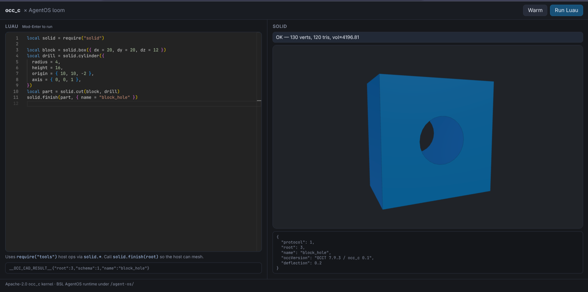

<div align="center">

# opencascade-bazel

**A clean C API and browser Wasm build of OpenCASCADE — so agents and apps never write C++.**

Hermetic [Bazel](https://bazel.build/) packaging of [OCCT](https://github.com/Open-Cascade-SAS/OCCT) **7.9.3**, with **`occ_c`** as the public product surface (inspired by [build123d](https://github.com/gumyr/build123d)’s modeling shape, not a class dump of OCCT).

<p>
  
  
  
  
</p>

<p>
  <a href="#product-occ_c">Product</a> ·
  <a href="#browser-demo">Browser demo</a> ·
  <a href="#build">Build</a> ·
  <a href="#agentos-scripting">AgentOS scripting</a> ·
  <a href="#licensing">Licensing</a> ·
  <a href="SYSTEM.md">System</a> · <a href="docs/README.md">Docs</a>
</p>

<p>
  
</p>

<p><em>Browser demo — parametric Luau (Monaco) drives host <code>occ_*</code> tools; mesh renders in-page.</em></p>

</div>

## Why this repo

Most CAD automation either forces C++ (OCCT), a heavy Python stack (OCP / build123d), or a black-box mesh generator. This repository does something narrower and more reusable:

1. **Package OCCT hermetically** (Bazel, pinned 7.9.3, modeling-focused toolkit subset).  
2. **Expose a stable C ABI** (`occ_c`) — opaque shapes, status codes, no C++ in the public header.  
3. **Ship the same ABI to the browser** as optimized Wasm (`//api:libocc_c_wasm`).  
4. **Optionally** host **AgentOS `loom` Luau** as a sandboxed scripting computer that calls CAD only through allowlisted host tools (BSL tree under [`agent-os/`](agent-os/)).

Callers (Rust, Zig, Go, Python, JS, agents) speak **C / Wasm**, not `TopoDS_*`.

## Product: `occ_c`

| Path | Role |
|------|------|
| [`api/include/occ_c.h`](api/include/occ_c.h) | Public C header — **the contract** |
| [`api/src/occ_c.cc`](api/src/occ_c.cc) | Thin OCCT mapping (implementation detail) |
| [`//api:libocc_c`](api/BUILD.bazel) | Native shared library (`libocc_c.so`) |
| [`//api:libocc_c_wasm`](api/BUILD.bazel) | Browser module (`libocc_c.js` + `.wasm`) |
| [`//examples/c_api`](examples/c_api/) | Pure-C end-to-end demo |

**Conventions:** opaque `occ_shape_t` / `occ_mesh_t`; caller frees; `OCC_OK` / `occ_last_error()`; **1-based** topology indices; primitives, booleans, fillets, sweeps, transforms, measure, STEP/BREP/STL/mesh.

## Browser demo

The image above is the working vertical slice: **Luau in AgentOS → host CAD tools → OCCT mesh → WebGL view**, with human Run/approve in the loop.

```bash
# After AgentOS release assets + libocc_c Wasm are staged (see agent-os/README.md):
./agent-os/scripts/dev.sh
# → http://127.0.0.1:8765/
```

| Piece | Role |
|-------|------|
| Monaco + Luau Monarch | Editable parametric intent (not a screenshot of CAD) |
| Runtime worker | AgentOS `loom` + `createOccModule` |
| `solid.*` batteries | Thin Luau over host `cad.call` → `occ_*` |
| Mesh panel | Expert-visible geometry + kernel version metadata |

Architecture and decisions live in **[`SYSTEM.md`](SYSTEM.md)**. Viewport / camera / grid: **[`DISPLAY.md`](DISPLAY.md)**. Live params / gimbals: **[`REACTIVITY.md`](REACTIVITY.md)**. Doc index: **[`docs/README.md`](docs/README.md)**. Screenshot: [`docs/browser-demo.png`](docs/browser-demo.png).

## Build

Native default uses **hermetic zig cc** (`hermetic_cc_toolchain`) — no system gcc required:

```bash
bazel build //...
bazel run //examples/c_api
bazel build //api:libocc_c
```

### BuildBuddy remote cache + RBE (opt-in)

Same targets; config is `--config=buildbuddy` in [`.bazelrc`](.bazelrc). **No secrets in the tree.**

1. Account at [app.buildbuddy.io](https://app.buildbuddy.io/)  
2. [BuildBuddy CLI](https://www.buildbuddy.io/docs/cli) (`bb`)  
3. `bb login` (API key in local `.git/config` only)

```bash
bb build --config=buildbuddy //api:libocc_c //examples/c_api
bb run  --config=buildbuddy //examples/c_api
bb build --config=buildbuddy //api:libocc_c_wasm   # heavy; good RBE fit
```

With `--config=buildbuddy`, compile/link run **on RBE only** (no local spawn fallback). Optional CI: [`buildbuddy.yaml`](buildbuddy.yaml) after connecting the BuildBuddy GitHub app.

### Browser Wasm pipeline

Always release-oriented:

```text
force_opt (-c opt) → emcc -Os → wasm-opt -Oz --converge → size_limit (≤32 MiB)
```

| Artifact | Approx. size |
|----------|----------------|
| `libocc_c.wasm` (after opt) | ~27–28 MiB raw · ~7 MiB gzip |
| `libocc_c.js` | ~200 KiB |

```bash
bb build --config=buildbuddy //api:libocc_c_wasm
# or locally: bazel build //api:libocc_c_wasm
```

Tagged `manual` (not bare `//...`). Size gate: `//api:libocc_c_wasm_size_limit`.  
JS: `createOccModule()` then `ccall` / `cwrap` on `occ_*` (+ `malloc`/`free`).

## AgentOS scripting

**Product path for in-browser / agent Luau:** AgentOS **`loom`** + host tools over `libocc_c_wasm`, entirely under **[`agent-os/`](agent-os/)** (BSL). The Apache kernel never depends on it.

- Node smoke and browser demo: [`agent-os/README.md`](agent-os/README.md)  
- Task tracker: [`agent-os/TASKS.md`](agent-os/TASKS.md)  
- Pinned AgentOS release assets (v0.4.0) via `http_file` / `scripts/fetch-release.sh`

```text
Luau (sandbox) ──tools.call──► host ──occ_*──► OCCT Wasm ──mesh──► UI
```

## Layout

```text
api/                  # Apache-2.0 — C API + Wasm packaging
examples/c_api/       # Apache-2.0 — pure C API demo
agent-os/             # BSL 1.1 — AgentOS CAD scripting + browser demo
docs/                 # Doc index, clean-room report, demo screenshot
SYSTEM.md             # North star + design decisions
DISPLAY.md            # Browser CAD viewport (WebGL, camera, infinite grid)
REACTIVITY.md         # Parametric reactivity, gimbals, CADAM/Ao patterns
bazel/                # force_opt, wasm_opt, size_limit
third_party/occt/     # OCCT toolkit subset packaging
third_party/binaryen/ # wasm-opt
MODULE.bazel          # OCCT 7.9.3 + emsdk + hermetic_cc + AgentOS pins
AGENTS.md             # Conventions for coding agents
```

OCCT is fetched at build time (`@occt`). Local clones (`OCCT/`, `OCP/`, `build123d/`) and `scripting/` design notes are gitignored when present.

## Licensing

| Path | License |
|------|---------|
| Kernel, examples, packaging (everything except `agent-os/`) | **Apache-2.0** — [LICENSE](LICENSE) |
| [`agent-os/`](agent-os/) | **BSL 1.1** — [agent-os/LICENSE](agent-os/LICENSE) |

Linked OCCT remains under its LGPL-2.1 + exception terms.  
Apache consumers use `api/` and `examples/` only — they never need `agent-os/`.

## What this is not

- Not a C++ sample suite or full OCCT tutorial  
- Not Draw / OpenGL viewer / full data-exchange matrix  
- Not Python, OCP, or build123d in the build graph (references only)  
- Not an Apache redistribution of AgentOS (BSL under `agent-os/` only)

---

Copyright © 2025–2026 opyt.cloud
