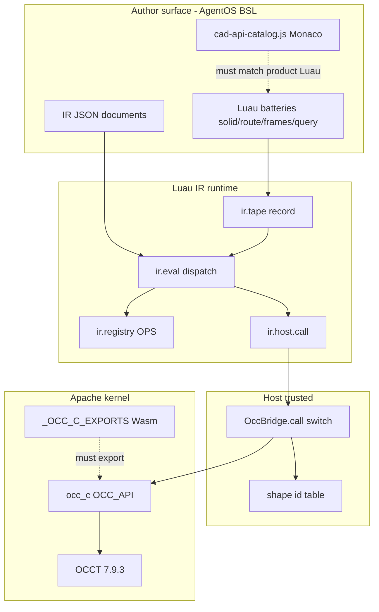
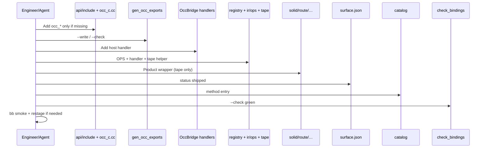
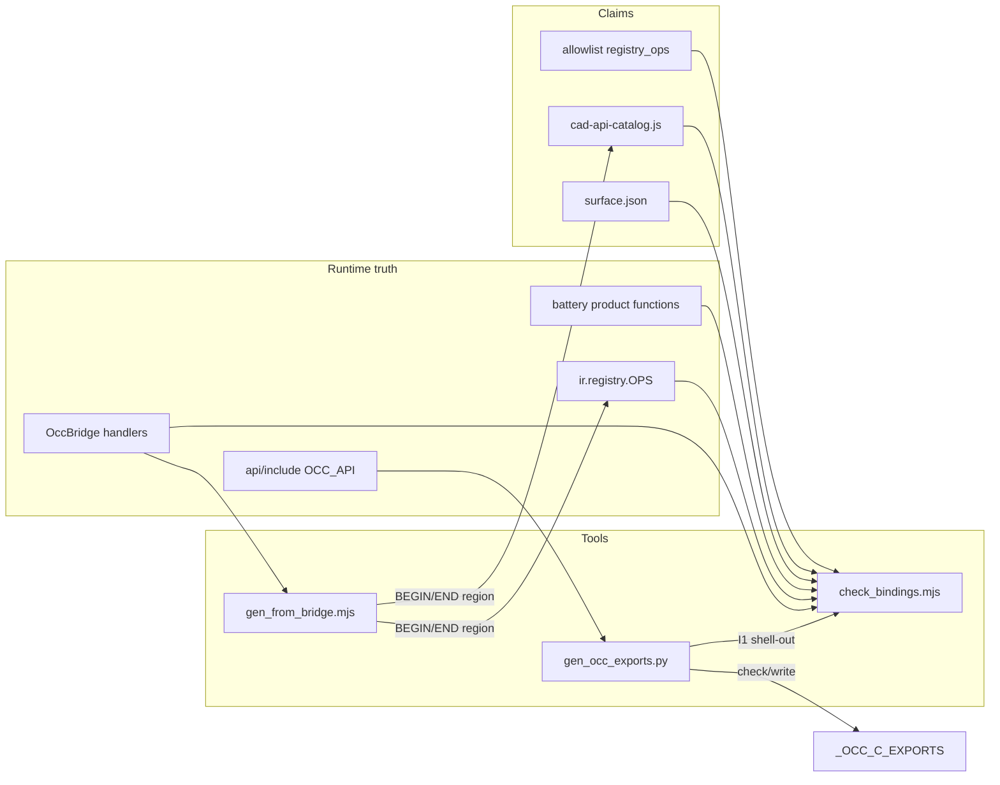

# Binding Lag: `occ_*` ↔ Host Op ↔ IR Op ↔ Luau Catalog

| Field | Value |
|-------|-------|
| **Document title** | Binding Lag Closure — Product Surface Alignment Across C, Host, IR, Luau, Catalog |
| **Author** | Design agent (opencascade-bazel) |
| **Date** | 2026-08-08 |
| **Status** | Draft (revision 4 — Dharma single pathway) |
| **Revision** | 2026-08-08r4 — Dharma-driven development: single canonical Luau path; query-only measures; io for I/O; I8 hard at PR3; dual export forbidden |
| **Audience** | Senior engineers and agents implementing AgentOS bindings over `occ_c` |
| **Authority** | Subordinate to [`SYSTEM.md`](../../SYSTEM.md), [`AGENTS.md`](../../AGENTS.md); IR semantics subordinate to [`docs/cad-ir-v0-design.md`](../cad-ir-v0-design.md) (K14: bridge growth follows IR catalog) |
| **Related** | [`docs/ir/schema/allowlist.json`](../ir/schema/allowlist.json) · [`scripts/gen_occ_exports.py`](../../scripts/gen_occ_exports.py) · [`agent-os/src/occ-bridge.js`](../../agent-os/src/occ-bridge.js) · [`agent-os/src/batteries/`](../../agent-os/src/batteries/) · [`agent-os/src/cad-api-catalog.js`](../../agent-os/src/cad-api-catalog.js) |

---

## Overview

Adding an `OCC_API` symbol in Apache `api/include/*.h` does **not** make it available to agents. Geometry reaches Luau only through a chain of hand-maintained allowlists: Wasm exports → host `cad.call` ops → IR registry / handlers → battery wrappers (`solid.*` / `route.*` / …) → Monaco catalog. Each link is edited separately; none is machine-checked against the others (except Wasm exports via `scripts/gen_occ_exports.py --check`). The result is **binding lag**: a large C surface (~213 symbols) with a thin AgentOS façade (~47 host ops, ~33 IR ops, ~37 `solid.*` methods). Drift is **uneven**: Wasm and IR registry host tables are nearly healthy; the **catalog host list** and **unmodeled planned ops** are the main silent failures.

This design proposes a **Binding Surface** system: (1) a single intentional **product surface map** (JSON in v1), (2) **discovery** of actual state from each layer’s source of truth, (3) **drift checks** that fail CI when *claims* disagree with *truth*, (4) **minimal codegen** for boring mirrors (`HOST_AVAILABLE`, `HOST_CAD_OPS`), and (5) a **table-driven OccBridge** so host ops are listable. The product path for authoring remains **IR tape → eval → host → `occ_c`**.

### Dharma-driven development (product principle)

**Do the right thing even when complex. Alpha means no cruft and no knowingly carried technical debt. Prefer destroy / refactor / rewrite over dual pathways.**

| Law | Binding-lag implication |
|-----|-------------------------|
| **Never two pathways** | One `require` module owns each capability. Dual export (`solid.volume` *and* `query.volume`) is **forbidden** as product policy. |
| **Never deprecated dual surfaces** | No “aliases for one release” product APIs. Hard cut: remove the non-canonical wrapper, update catalog/smokes/demos in the **same PR**. |
| **Willing to rewrite** | Existing duals on `solid.*` (measures, `member_sweep_rect`, `step_write`) are deleted and migrated — not papered over with `canonical` soft-warns. |

This principle is **Key Decision B19**. It supersedes earlier “dual export with canonical module” wording.

---

## Background & Motivation

### Measured coverage (repo snapshot, 2026-08-08)

| Layer | Artifact | Count | Notes |
|-------|----------|------:|-------|
| C ABI | `OCC_API` in `api/include/*.h` | **213** | via `scripts/gen_occ_exports.py` |
| Wasm exports | `api/BUILD.bazel` `_OCC_C_EXPORTS` | **215** | 213 + `_malloc`/`_free`; `--check` → **OK** |
| Host ops | `OccBridge.call` `case "…"` | **47** | includes geometry + measures + infra |
| `registry.HOST_AVAILABLE` | `ir/registry.luau` | **46** | **nearly in sync** with bridge; only **`kernel_version`** missing from HOST_AVAILABLE |
| Catalog host list | `HOST_CAD_OPS` | **41** | **real silent lag** — missing `session_opts`, `memo_begin`, `memo_end`, `cache_get`, `cache_put`, `cache_clear` (6 infra ops) |
| IR ops | `registry.OPS` | **33** | runtime SOT for known eval ops |
| Allowlist `registry_ops` | `allowlist.json` | **33** | **set-equal** to `registry.OPS` today |
| Allowlist `tier_b` aspirational | `bridge: need` rows | **4** | `GroupBodies`, `ExportBrep`, `MakeCircleProfile`, `MakePolyline` — **not** in `registry_ops` |
| `solid.*` functions | battery | **37** | includes interop `realize` |
| Catalog solid | `SOLID_METHODS` | **36** | only gap: **`realize`** (intentional interop, not product UX) |
| `route` / `frames` / `query` | battery / catalog | **5 / 7 / 6** | **catalog method parity already green** for these three |
| Monaco catalog | `cad-api-catalog.js` | ~933 LOC | hand-authored docs/snippets |
| MANIFEST ↔ worker | batteries lists | **synced** | preventive check still valuable |

Inequality that matters:

```text
occ_c (213)  ≫  host cad.call (47)  ≥  IR ops (33) + batteries  ≈  catalog
                    ↑                        ↑
              HOST_AVAILABLE ≈ 46/47    HOST_CAD_OPS lags by 6 infra
              solid catalog 36/37 (realize)
              route/frames/query catalog already OK
```

Roughly **~80% of C symbols** have no host path. That is **not** a bug by itself: many are session/topology helpers not yet product-facing. The bug is that **nothing enforces intentional product coverage** and **mirrors drift without CI**.

### Drift severity (accurate picture)

| Pair | Current state | Severity |
|------|---------------|----------|
| headers ↔ `_OCC_C_EXPORTS` | Checked OK by Python tool | Low (keep I1 = shell-out only) |
| bridge ↔ `HOST_AVAILABLE` | 46/47; missing `kernel_version` only | Low (specify include/exclude; not “aspirational chaos”) |
| bridge ↔ `HOST_CAD_OPS` | 41/47; missing 6 infra | **High** (catalog claim lies) |
| `registry.OPS` ↔ `registry_ops` | Exact set equality | Low (lock with I4 registered set) |
| allowlist `bridge: need` | Aspirational, outside registered | Medium (model as planned, not eval-known) |
| solid ↔ `SOLID_METHODS` | 36/37; only `realize` | Policy (B13), not silent product lag |
| route/frames/query ↔ catalog | Perfect name parity | Green — Phase 4 is solid-centric + annotations |

### Current architecture (authoritative product path)

From `SYSTEM.md` §3.1 and cad-ir amendment **K3 supersession** (solid always IR tape):



**Already correct policy:**

- Batteries author via **IR tape only** (`solid.luau` header; `batteries/MANIFEST`).
- Geometry truth is `occ_c`; guest holds shape **IDs** (or IR string handles until `finish`).
- Wasm export drift has a real tool: `python3 scripts/gen_occ_exports.py --check|--write`.

**Still manual (lag sources):**

| Manual artifact | Path | Pain |
|-----------------|------|------|
| Host switch | `agent-os/src/occ-bridge.js` `call()` | ~290-line switch; no enum |
| Host-ready table | `registry.HOST_AVAILABLE` | Near-mirror of bridge (46/47); still hand-edited |
| Catalog host list | `HOST_CAD_OPS` | **6 infra ops behind** bridge |
| Catalog methods | `SOLID_METHODS` etc. | Hand docs; solid/`realize` policy needed |
| IR allowlist | `allowlist.json` | `registry_ops` OK; `bridge: need` / stale `ExportBrep` host name |
| Battery file lists | `TOP_BATTERY_LUAU` / `IR_LUAU_FILES` vs `MANIFEST` | **Already synced**; guard against future lag |

IR design **K14**: *“Bridge growth follows IR catalog, not curiosity.”* This document operationalizes that for **all layers**.

### Pain points (concrete)

1. **Four-or-five-place wiring** for one feature: C (if new) → exports → bridge → IR → battery → catalog → smokes.
2. **Catalog host list lies** — `HOST_CAD_OPS` omits 6 real bridge ops (mostly infra); agent UX may also omit rare interop methods by design (B13).
3. **`HOST_AVAILABLE` is a hand mirror**, nearly correct today (46/47) but still unenforced; K15 host-ready must stay true as the bridge grows.
4. **Tier B `bridge: need` rows** (`GroupBodies`, `MakeCircleProfile`, `MakePolyline`, superseded `ExportBrep`) sit without a backlog owner; stale host name `export_step` is a phantom.
5. **Wasm size limit** (32 MiB) still applies when growing C; prefer bridge over new C when the symbol exists.

---

## Goals & Non-Goals

### Goals

1. **Make binding lag measurable** — single report: per-layer counts, missing edges, tier status.
2. **Make lag fail CI** when *claimed* product surface disagrees with *actual* implementation.
3. **Define a Luau libs catalog** (module layout, naming, **single-path ownership**).
4. **Preserve IR-tape product path** — batteries always record IR; host is lowerer only.
5. **Minimize hand sync** — generate or check-derived lists; human edits at intent + implementation.
6. **Incremental rollout** — discover + check first; table-driven bridge + codegen next.
7. **License-safe** — Apache tools under `scripts/` / `api/`; BSL under `agent-os/bindings/`.

### Non-Goals

| Non-goal | Why |
|----------|-----|
| Expose all 213 `occ_*` to Luau | Intentional product surface |
| Auto-generate C from IR or vice versa | C grows from modeling need |
| Freestanding Luau/OCCT | Forbidden by `AGENTS.md` / `SYSTEM.md` |
| Sketch2D / SolveSketch binding | Constitution; stub module only later |
| Deploy/CDN packaging redesign | Out of scope |
| Replace IR with direct host solid.* | Tape is law |
| Full JSON Schema CI for IR docs | K21: Luau validate is product path |
| Perfect Luau AST type extraction in v1 | Regex + annotations enough |
| `params` / `params_resolve` in geometry lag chain | Staging/MANIFEST only; not host/IR lowers (B18) |

---

## Key Decisions

| # | Decision | Rationale |
|---|----------|-----------|
| **B1** | **Product surface is intentional**, not “all OCC_API.” Surface map lists only ops we claim. | Avoids 200+ shallow bindings. |
| **B2** | **Truth hierarchy:** headers → Wasm (via Python tool); bridge handlers → host ops; `registry.OPS` → IR names; battery **product** methods → Luau API; catalog method names ⇔ product Luau; catalog host list and HOST_AVAILABLE are **claims** checked against bridge with explicit membership rules (B14). | One runtime SOT per layer; no four-way equal-drift fiction. |
| **B3** | **Surface map is the claim of intent** (`agent-os/bindings/surface.json` in v1). CI checks map ⇔ implementations; map is not a second eval table. | Avoid dual runtime sources. |
| **B4** | **Drift checks before full codegen.** Phase 1 report + `--check`; later generate mirrors only. | Low risk; green CI early. |
| **B5** | **Table-driven OccBridge** with `listOps()` / `hasOp()`. | Enumerable host surface. |
| **B6** | **`registry.OPS` is runtime SOT for known IR ops.** Allowlist `registry_ops` must equal that set (registered). Aspirational ops live in surface map `planned` and/or allowlist narrative, not in `registry_ops`. | Matches K21; clear I4. |
| **B7** | **Luau module taxonomy** is product-facing (solid / route / frames / query / **io** / …), not C header layout. **Exactly one** module owns each capability; dual product exports are forbidden (B19). | Agent UX + dual goals without dual APIs. |
| **B8** | **Prefer bridge growth over new C** when `occ_*` exists. | K14 / Wasm size. |
| **B9** | **Catalog is claim, never creative SOT.** Method names + host lists must pass drift; docs/snippets may be hand-authored. | Stops catalog lying. |
| **B10** | **Apache vs BSL:** `gen_occ_exports.py` root/Apache; binding tools under `agent-os/bindings/` (BSL); `docs/bindings/` process only. **Forbidden:** binding tools writing under `api/`. | License boundary. |
| **B11** | **Fixed add-op ladders** (geometry product / host infra / pure POD), ending in `--check` green. | Removes “which files?” |
| **B12** | **Session / topology C APIs** Tier S or D until session mode needs them. | Avoid dumping session into solid. |
| **B13** | **Product public Luau** = `function mod.x` minus **interop allowlist** (default: `solid.realize`). Catalog I5/I6 use product set only. Interop methods may appear in catalog with `interop: true` (optional) but are **not** required. Config: `surface.json` → `luau_interop` or `check_bindings` config. | PR3 must not fail on `realize` or force a catalog lie. |
| **B14** | **Host op classes partition every bridge op.** Classes: (1) **`geometry_measure`** — **residual default**: every bridge op not in the other named classes (includes IR lowers *and* optional host helpers such as **`frame_from_axes`**, which is in HOST_AVAILABLE today but is not an IR `registry.OPS` lower because AttachFrame is pure POD); (2) **`session_infra`** — `session_opts`, `memo_*`, `cache_*`, `shape_free`, `free_all`; (3) **`kernel_meta`** — `kernel_version` (excluded from HOST_AVAILABLE equality by default); (4) **`mesh_interop`** — host `mesh` (full payload for viewport; not IR freestanding lower — IR uses `mesh_stats` / `ExportMesh`). Bootstrap **must emit a complete partition**: `∪ classes = bridge ops` and classes are pairwise disjoint. Optional explicit `host_helper` subclass annotation for docs only; membership still under `geometry_measure` residual. | Stops overstating registry lag; defines I3; covers `frame_from_axes`. |
| **B15** | **I1 is shell-out only** to `python3 scripts/gen_occ_exports.py --check`. No parallel OCC_API regex in Node. New C still: header → `gen_occ_exports.py --write` → BUILD. | Avoid dual scrapers. |
| **B16** | **Three allowlist/surface sets:** (1) **registered** = `registry.OPS` = `registry_ops` (hard equality); (2) **planned** = surface `status: planned` and/or former `bridge: need` (not eval-known); (3) **extension** = `tier_c_extension` + deferred. **`ExportBrep` is superseded by `StepWrite`** (host `step_write`); do not invent `export_step`. BREP write is a separate planned row if needed (`occ_brep_write`). | Fixes I4 ambiguity and phantom host. |
| **B17** | **Surface map format v1 is JSON** (`surface.json`). No `js-yaml` dependency. Optional YAML later if compiled to JSON. Checker reads **only JSON**. | Matches allowlist tooling; smoke-friendly. |
| **B18** | **`params` / `params_resolve`** stay on MANIFEST/stage lists only; out of geometry binding surface map unless they gain host geometry lowers. | Scope control. |
| **B19** | **Dharma-driven surface:** do the right thing; alpha forbids cruft and known dual pathways. **One canonical Luau path per capability** — never two product surfaces, never “deprecated dual” aliases. Measures → **`query.*` only**; member sweeps → **`route.*` only**; import/export → **`io.*` only** (create `io.luau` if missing). Hard-delete non-canonical wrappers in the same PR as catalog/smoke/demo migration. Soft dual-export warnings are **not** product policy. | User-resolved Q1–Q3; prevents permanent lag via convenience aliases. |

---

## Proposed Design

### 1. Layer model and contracts

```text
Layer 0  OCC_API symbols          truth: api/include/*.h  (via gen_occ_exports.py only)
Layer 1  Wasm EXPORTED_FUNCTIONS  truth: generated/checked by same Python tool
Layer 2  Host cad.call ops        truth: OccBridge handlers / case labels / listOps()
Layer 3  IR ops + host lowers     truth: ir/registry.luau OPS (+ handlers in ir/ops/*)
Layer 4  Luau batteries           truth: product public functions (B13)
Layer 5  Monaco catalog           claim: cad-api-catalog.js
Layer 6  Surface map              claim: intentional coverage (surface.json)
```

**Invariants (CI-enforced):**

| ID | Invariant | Hard/soft |
|----|-----------|-----------|
| **I1** | `gen_occ_exports.py --check` exits 0 (no Node reimplementation) | Hard |
| **I2** | Every host lower in `registry.OPS` (non-pure) ∈ OccBridge ops | Hard |
| **I3** | `HOST_AVAILABLE` == bridge ops in **`geometry_measure ∪ session_infra ∪ mesh_interop`** (B14 residual partition). Excludes **`kernel_meta`** (`kernel_version`) by default. Therefore today’s 46/47 HA matches once `kernel_version` is excluded; **`frame_from_axes`** stays in the HA set as residual `geometry_measure`. Generated or checked. | Hard (after membership config) |
| **I4-reg** | `registry.OPS` keys **==** `allowlist.registry_ops` (set equality) | Hard |
| **I4-plan** | Every allowlist `bridge: need` / surface `planned` row is listed in surface map planned backlog; **not** required in `registry_ops` | Soft report / hard after map curated |
| **I5** | Every **product** battery method (B13) ∈ catalog method tables for that module | Hard in PR3 |
| **I6** | Every catalog method name (non-interop) ∈ product battery methods | Hard in PR3 |
| **I7** | Every `HOST_CAD_OPS` entry ∈ OccBridge ops | Hard |
| **I7b** | Policy for which bridge ops must appear in `HOST_CAD_OPS`: all geometry/measure + session infra; optional `kernel_version`; **not** required to list every infra if catalog marks advanced section — **v1: require HOST_CAD_OPS ⊆ bridge and include the 6 missing infra so claim is honest** | Hard for ⊆; recommend ⊇ for known infra set in config |
| **I8** | Surface `status: shipped` ⇒ all declared non-null edges exist (host / IR / single Luau path / catalog). **Soft only during PR1–PR2 draft** before human curation; **hard-fail from PR3** once the map is intentional (B19 alpha — no soft debt after curation). | Soft PR1–PR2; **hard PR3+** |
| **I9** | Surface `host` ⊆ bridge; surface `occ` ⊆ normalized OCC set from `gen_occ_exports.py --format list` (see discovery adapter). I1 remains `--check` only. | Soft then hard |

**I5+I6** force **catalog ⇔ product Luau** name equality (docs may differ). Interop `realize` is excluded unless catalog adds `interop: true`.

### 2. Binding Surface Map

**Path (BSL):** `agent-os/bindings/surface.json`  
**Optional later:** YAML source compiled to this JSON  
**Apache process summary:** `docs/bindings/README.md`

#### Schema (conceptual)

```json
{
  "version": 1,
  "cad_ir": "cad.ir/v0",
  "notes": "Intentional AgentOS product surface. Runtime truth: headers/bridge/registry/batteries.",
  "luau_interop": ["solid.realize"],
  "host_classes": {
    "geometry_measure": "residual",
    "session_infra": ["session_opts", "memo_begin", "memo_end", "cache_get", "cache_put", "cache_clear", "shape_free", "free_all"],
    "kernel_meta": ["kernel_version"],
    "mesh_interop": ["mesh"],
    "_notes": "geometry_measure = bridge_ops \\ (session_infra ∪ kernel_meta ∪ mesh_interop). Includes IR lowers and host helpers e.g. frame_from_axes. Bootstrap expands residual to a sorted explicit list for diffs."
  },
  "host_infra": ["session_opts", "memo_begin", "memo_end", "cache_get", "cache_put", "cache_clear"],
  "modules": {
    "solid": { "require": "solid", "role": "Solid prims, booleans, xforms, features, finish" },
    "route": { "require": "route", "role": "Centerlines, pipe annulus, structural members" },
    "frames": { "require": "frames", "role": "Frames, FK ComposeChain, rigid place" },
    "query": { "require": "query", "role": "Measures and clash (tape eval_measure) — sole owner" },
    "io": { "require": "io", "role": "Import/export (step_write now; step_read/brep later)" }
  },
  "ops": [
    {
      "id": "prim.box",
      "tier": "A",
      "status": "shipped",
      "occ": "occ_make_box",
      "host": "make_box",
      "ir": "PrimBox",
      "module": "solid",
      "luau": "solid.box"
    },
    {
      "id": "route.member_sweep_rect",
      "tier": "B",
      "status": "shipped",
      "occ": "occ_member_sweep_rect",
      "host": "member_sweep_rect",
      "ir": "MemberSweepRect",
      "module": "route",
      "luau": "route.member_sweep_rect",
      "notes": "Single path; solid.member_sweep_rect deleted (B19)"
    },
    {
      "id": "query.volume",
      "tier": "A",
      "status": "shipped",
      "occ": "occ_volume",
      "host": "volume",
      "ir": "QueryGeom",
      "module": "query",
      "luau": "query.volume",
      "notes": "Measures only on query.*; solid.volume removed"
    },
    {
      "id": "bool.group_bodies",
      "tier": "B",
      "status": "planned",
      "occ": "occ_make_compound",
      "host": "make_compound",
      "ir": "GroupBodies",
      "module": "solid",
      "luau": "solid.compound",
      "notes": "C exists; bridge + IR handler + battery + catalog needed"
    },
    {
      "id": "io.step_write",
      "tier": "B",
      "status": "shipped",
      "occ": "occ_step_write",
      "host": "step_write",
      "ir": "StepWrite",
      "module": "io",
      "luau": "io.step_write",
      "notes": "io.luau owns I/O; solid.step_write removed; supersedes ExportBrep/export_step"
    },
    {
      "id": "io.brep_write",
      "tier": "B",
      "status": "planned",
      "occ": "occ_brep_write",
      "host": "brep_write",
      "ir": null,
      "module": "io",
      "luau": "io.brep_write",
      "notes": "Separate from StepWrite; do not invent export_step"
    },
    {
      "id": "export.brep_legacy",
      "tier": "B",
      "status": "superseded",
      "occ": null,
      "host": null,
      "ir": "ExportBrep",
      "module": null,
      "luau": null,
      "notes": "Superseded by StepWrite / io.step_write; remove export_step in PR6"
    }
  ]
}
```

**Rules:**

- `status: shipped` ⇒ CI **I8 hard from PR3** requires all non-null of `{host, ir, luau}` to exist (single string `luau`, not an array of aliases).
- `status: planned` ⇒ missing edges allowed; lag report backlog.
- `status: superseded` ⇒ must not appear as eval-known; allowlist cleanup target.
- `host: null` + pure IR POD is valid.
- **`luau` is a single product path** (`"query.volume"`). Arrays of dual aliases are **invalid** surface schema under B19.
- **`module`** names the owning battery; must match the `luau` prefix.
- Hard check (PR3+): no second battery may export a product function for the same surface `id`.
- Host infra ops tracked under `host_infra` / `host_classes`, not as geometry `ops` rows.

### 3. Discovery & lag report

**Tool:** `agent-os/bindings/check_bindings.mjs` (Node ESM; no OCCT)

```text
Usage:
  node agent-os/bindings/check_bindings.mjs           # human report
  node agent-os/bindings/check_bindings.mjs --check    # exit 1 on hard invariant break
  node agent-os/bindings/check_bindings.mjs --json     # machine report
```

**Discovery adapters:**

| Adapter | Input | Output | Notes |
|---------|-------|--------|-------|
| `checkOccExports` | spawn `python3 scripts/gen_occ_exports.py --check` | exit code / stderr | **I1 only path** — no Node OCC_API regex |
| `listOccSymbols` | `python3 scripts/gen_occ_exports.py --format list` | set for I9 | **Normalize:** keep lines starting with `_occ_`; strip leading `_` → `occ_*` (e.g. `_occ_make_box` → `occ_make_box`). Drop `_malloc` / `_free`. Compare surface `occ` fields to that set. Subprocess only; no Node OCC regex. I1 stays `--check` only. |
| `discoverHostOps` | `occ-bridge.js` or `listOps()` | set of op strings | Prefer `listOps()` when present (post-PR4); regex `case "…":` fallback during transition |
| `discoverIrOps` | `registry.luau` | OPS keys + host lowers + HOST_AVAILABLE | |
| `discoverAllowlist` | `allowlist.json` | `registry_ops`, tier_a/b, bridge:need | Split registered vs planned |
| `discoverLuauExports` | batteries incl. **`io.luau`** | all `function mod.name` | Subtract `luau_interop` → product set; fail if forbidden duals (solid measures / solid.step_write / solid.member_sweep_rect) exist |
| `discoverCatalog` | `import('../src/cad-api-catalog.js')` from smoke/bindings | method names + HOST_CAD_OPS | ESM path: from `agent-os/bindings/` use `../src/cad-api-catalog.js` |
| `loadSurfaceMap` | `surface.json` | intentional rows + host_classes | JSON only |

**Adapter unit tests (PR2):** golden fixtures under `agent-os/bindings/fixtures/` — tiny fake bridge snippet, registry fragment, catalog export, surface.json — so regex/import changes cannot silently under-count.

**Report sections:**

1. **Counts**  
2. **Critical drift** — hard invariant failures  
3. **Backlog** — planned / bridge:need  
4. **Orphans** — host ops with no IR lower: classify via B14 partition (`session_infra` / `mesh_interop` / residual `geometry_measure` helpers e.g. `frame_from_axes` / dead)  
5. **C not in map** — informational  
6. **Single-path violations** — second product export for a surface id (e.g. residual `solid.volume`) → **hard fail PR3+**

Example drift detail (honest):

```json
{
  "counts": {
    "occ_api": 213,
    "host_ops": 47,
    "host_available": 46,
    "host_available_missing": ["kernel_version"],
    "host_cad_ops": 41,
    "ir_ops": 33,
    "solid_product_methods": 36,
    "solid_interop": ["realize"],
    "catalog_solid": 36
  },
  "drift": [
    {
      "invariant": "I7",
      "detail": "HOST_CAD_OPS missing bridge ops (infra): session_opts, memo_begin, memo_end, cache_get, cache_put, cache_clear"
    }
  ]
}
```

**Wire-in:**

- `agent-os/smoke/bindings_smoke.mjs` — pure Node.  
- Add to `agent-os/smoke/BUILD.bazel` `smoke_srcs` when the file lands.  
- Document commands in `agent-os/README.md` + `agent-os/TASKS.md` (with PR3).  
- No RBE/`bb` required for pure static checks (local `node`).

### 4. OccBridge table-driven handlers (B5)

**Target:**

```js
// agent-os/src/occ-bridge-ops.js  (or section of occ-bridge.js)
export function buildHandlers(bridge) {
  return {
    // kernel_meta
    kernel_version: () => bridge.version(),
    // geometry / measure …
    make_box: (a) => { /* … */ return { shapeId }; },
    // mesh_interop — full mesh payload for host UI; not IR freestanding lower
    mesh: (a) => bridge.mesh(a.id, a.deflection),
    mesh_stats: (a) => { /* stats only */ },
    // session_infra
    session_opts: () => ({ … }),
    memo_begin: () => { … },
    // …
  };
}

call(op, args = {}) {
  const fn = this.handlers[op];
  if (!fn) throw new Error(`unknown cad op: ${op}`);
  return fn(args);
}

listOps() {
  return Object.keys(this.handlers).sort();
}
```

**Discovery policy (PR4+):** if `bridge.listOps` exists, use it; else regex `case "…"`.

**Host `mesh` (security):** already returns full mesh arrays for the trusted host viewport path. Classify as **mesh_interop**: allowlisted `cad.call` only; **IR eval must not** lower freestanding authoring to `mesh` (use `mesh_stats` / `ExportMesh`). Guest cannot invent new host ops beyond the host tool broker allowlist (existing D8). Do **not** auto-bind raw `occ_mesh_vertices` as a separate guest API.

### 5. Codegen policy — HOST_AVAILABLE mechanics (locked)

| Artifact | v1 | v2 | Owner edit? |
|----------|----|----|-------------|
| `_OCC_C_EXPORTS` | `gen_occ_exports.py` only | same | headers only |
| `registry.HOST_AVAILABLE` | **check** vs bridge (B14 sets) | **generate** delimited region in `registry.luau` | no |
| `HOST_CAD_OPS` | **check** | **generate** delimited region in `cad-api-catalog.js` | no |
| `allowlist.registry_ops` | **check** == `registry.OPS` | optional generate | IR docs |
| Catalog method names | **check** vs product Luau | optional annotations | docs yes |
| `surface.json` | hand (+ bootstrap draft in PR1) | hand | yes |

**Locked approach for PR5 (preferred):** rewrite a **delimited region inside `registry.luau`** — no new IR package file (avoids MANIFEST / `IR_LUAU_FILES` churn).

```luau
-- BEGIN HOST_AVAILABLE (generated by agent-os/bindings/gen_from_bridge.mjs; do not hand-edit)
registry.HOST_AVAILABLE = {
	make_box = true,
	-- …
}
-- END HOST_AVAILABLE
```

Same pattern for catalog:

```js
// BEGIN HOST_CAD_OPS (generated by …; do not hand-edit)
export const HOST_CAD_OPS = [ … ];
// END HOST_CAD_OPS
```

**Rejected for v1:** separate `host_available.luau` (forces MANIFEST + `IR_LUAU_FILES` + staging updates in the same PR as codegen — couple to PR7). May revisit later.

**Round-trip test (required with PR5):** `gen_from_bridge.mjs --write` then `check_bindings.mjs --check` clean; second write is no-op (stable sort).

```bash
node agent-os/bindings/gen_from_bridge.mjs --write
node agent-os/bindings/check_bindings.mjs --check
```

Membership for generated HOST_AVAILABLE follows B14 residual partition: **all bridge ops except `kernel_meta`** (i.e. `geometry_measure ∪ session_infra ∪ mesh_interop`, which includes `frame_from_axes`). Bootstrap expands `"geometry_measure": "residual"` to an explicit sorted list for human diffs.

### 6. Luau libraries catalog (clean module layout)

There is **no prior dedicated catalog design** beyond Phase A comments in `cad-api-catalog.js` and IR allowlist narrative. This section is normative.

#### 6.1 Module map

| Module | `require` | Owns (sole product path) | Does **not** own |
|--------|-----------|--------------------------|------------------|
| **solid** | `solid` | Prims, booleans, xforms, fillet/shell/offset/holes, patterns, extrude/revolve/pipe profile, `finish`, session free | Measures; member sweeps; STEP/BREP I/O; pure FK math; route centerlines |
| **route** | `route` | RoutePath, SweepAlong annulus, **member sweeps**, `pipe_run` | Box/cyl prims; robot FK; measures |
| **frames** | `frames` | AttachFrame, ComposeChain, place/trsf, pure matrix helpers | Solid creation; measures |
| **query** | `query` | **All measures** — clash, distance, volume, bbox, mesh_stats, mass_props | Authoring ops; I/O |
| **io** | `io` | **Import/export** — `step_write` now; step_read / brep_* when bound | Geometry authoring; measures. **Create `io.luau` if missing** as part of binding work (not “later on solid”). |
| **cad** | `cad` | Aggregator only (`cad.solid` / `cad.query` / `cad.io` / …) | New geometry APIs of its own |
| **ir** | `ir` | Load/validate/eval/tape | Domain recipes |
| **params** / **params_resolve** | staging only | Param sugar / harvest | Geometry lag map (B18) |
| **construct** *(future)* | `construct` | Wires, faces, ExplicitCoords profiles | Sketch solve |
| **sketch** *(stub later)* | `sketch` | Constitution-gated | Must not land without Active Slice |

#### 6.2 Naming and single pathway (B19)

- **snake_case** methods; IR ops remain PascalCase.
- Shape args are IR string handles until `finish` / `realize`.
- **Exactly one product Luau path per capability.** Forbidden duals (delete from solid in migration PR):
  - Measures: **`query.*` only** — remove `solid.volume`, `solid.bbox`, `solid.clash`, `solid.distance`, `solid.mesh_stats`, `solid.mass_properties`.
  - Member sweeps: **`route.member_sweep_rect` only** — remove `solid.member_sweep_rect`.
  - I/O: **`io.step_write` only** — remove `solid.step_write`; add `io.luau` to MANIFEST + `TOP_BATTERY_LUAU` + catalog `MODULES`.
- **No deprecated aliases.** Hard cut same PR as catalog, smokes, demos (`block_hole`, flange snippets, etc.).
- `solid.finish` stays on solid (emit root for host); I/O is not solid’s job.

#### 6.3 Versioning

| Field | Meaning |
|-------|---------|
| `meta.lib_versions.cad_ir` | Additive IR ops / handler behavior |
| `surface.json` `version` | Map schema version |
| No per-file solid semver in v1 | Rely on `cad_ir` + pins |

#### 6.4 Catalog vs runtime

| In Monaco catalog | Not required in catalog |
|-------------------|-------------------------|
| Product battery methods (B13) after single-path migration | `luau_interop` (`solid.realize`) unless `interop: true` entry |
| `require` modules including **`io`** | Private `local function` helpers |
| Snippets using **query.*** / **io.*** / **route.*** (no solid measure/IO duals) | Host infra in advanced section optional |
| `ir.load` / `eval` / `run_demo` | `ir.ops.*` internals |

After Dharma migration, catalog must **not** list removed solid measures / `step_write` / `member_sweep_rect`. Name parity work includes hard-deleting those SOLID_METHODS entries.

#### 6.5 Catalog validation / annotations

**Phase A:** hand-authored catalog; name equality via check tool.  
**Phase B:** optional `-- @catalog` annotations above Luau functions for insertText/doc overrides; generator merges into catalog or side file.

### 7. End-to-end ladders (B11)

#### 7.1 Geometry product op (default)



**Checklist:**

1. [ ] C symbol exists (or pure POD N/A).  
2. [ ] `python3 scripts/gen_occ_exports.py --check` (if C/exports touched).  
3. [ ] Host handler + `listOps` includes name.  
4. [ ] IR: `registry.OPS`, handler, eval dispatch, `tape.*` if authoring.  
5. [ ] `allowlist.json` only if **registered** (not for planned-only).  
6. [ ] Battery product API + types.  
7. [ ] Catalog method + docs (product methods).  
8. [ ] `surface.json` status / single `luau` path / `module`.  
9. [ ] `node agent-os/bindings/check_bindings.mjs --check`.  
10. [ ] Smoke via `bb` where OCCT involved; pure Node for bindings.  
11. [ ] **Restage AgentOS vendor Wasm/JS even when only bridge JS changes** if staged `libocc_c.*` must match (IR §8.3); always restage after C/export changes.

#### 7.2 Host infra op (memo/cache/session_opts/kernel_version)

Short-circuit — **no IR op, no battery, no allowlist registry_ops**:

1. [ ] Bridge handler.  
2. [ ] Classified in `host_classes` / `host_infra`.  
3. [ ] HOST_AVAILABLE / HOST_CAD_OPS per B14 (regen or hand until PR5).  
4. [ ] Optional advanced catalog note.  
5. [ ] `check_bindings --check`.  

#### 7.3 Pure IR POD (e.g. AttachFrame math)

1. [ ] IR op + pure handler (`host: false`).  
2. [ ] Battery / frames API.  
3. [ ] Catalog + surface (`host: null`).  
4. [ ] No OccBridge geometry entry required (optional host helper OK).  
5. [ ] Check green.

### 8. Prioritized binding backlog

Prefer dual-goal + former `bridge: need` first. Each row names **host**, **IR**, **sole Luau path** (B19).

| Priority | Capability | C | Host op | IR op | Sole Luau path | Notes |
|----------|------------|---|---------|-------|----------------|-------|
| P0 | Dual-goal Tier A | yes | existing | registered | solid/route/frames/query/io | Keep green; **single-path clean** (PR3a) |
| P0 | Measures migration | yes | existing | QueryGeom/Clash/… | **`query.*` only** | Delete solid measure wrappers |
| P0 | I/O module | yes | `step_write` | StepWrite | **`io.step_write`** | Create `io.luau`; delete solid.step_write |
| P0 | Member sweep single path | yes | `member_sweep_rect` | MemberSweepRect | **`route.member_sweep_rect` only** | Delete solid.member_sweep_rect |
| P1 | Group bodies | `occ_make_compound` | `make_compound` | `GroupBodies` | `solid.compound` | C ready; full ladder |
| P1 | Circle profile | `occ_make_circle_face` | `make_circle_face` | `MakeCircleProfile` | `construct.circle_face` or solid temp | allowlist need |
| P1 | Polyline | `occ_make_polyline` | `make_polyline` | `MakePolyline` | `construct.polyline` | ExplicitCoords |
| P1 | Chamfer all | `occ_chamfer_all` | `chamfer_all` | `ChamferAll` | `solid.chamfer_all` | Mirror fillet_all |
| P2 | Counterbore/sink | hole APIs | `drill_hole_counterbore` / `_countersink` | new IR | `solid.drill_*` | Industrial holes |
| P2 | Fillet/chamfer edges | yes | deferred | needs selectors | — | Session/selectors |
| P2 | Loft | `occ_loft*` | `loft` | `LoftSections` | `solid.loft` | Extension |
| P2 | STEP/BREP **read** | yes | `step_read` / `brep_read` | optional | **`io.*` only** | Import path |
| P2 | BREP **write** | `occ_brep_write` | `brep_write` | optional | **`io.brep_write`** | Not solid |
| P2 | Pattern along path | `occ_pattern_along_path` | `pattern_along_path` | `PatternAlongPath` | `solid.pattern_along_path` | |
| P2 | Polar full circle | `occ_pattern_polar_full_circle` | `pattern_polar_full_circle` | extend PatternPolar | `solid.pattern_polar_full` | |
| P3 | Session entity API | yes | — | freestanding first | — | IR session mode |
| P3 | Ray cast / select faces | yes | — | illegal freestanding faces | query later | Selector policy |
| D | Sketch2D/SolveSketch | n/a | — | Tier C | sketch stub | Constitution |
| — | **ExportBrep / export_step** | — | **do not add** | **superseded** | — | Use **`io.step_write`** |

### 9. Architecture diagram (target tooling)



---

## API / Interface Changes

### New files (primary)

| Path | License | Role |
|------|---------|------|
| `agent-os/bindings/surface.json` | BSL | Intentional product surface (single-path `luau`) |
| `agent-os/bindings/check_bindings.mjs` | BSL | Discover + report + `--check` |
| `agent-os/bindings/fixtures/*` | BSL | Adapter golden snippets |
| `agent-os/bindings/bootstrap_surface.mjs` | BSL | One-shot draft generator (PR1) |
| `agent-os/bindings/gen_from_bridge.mjs` | BSL | PR5 delimited-region writer |
| `agent-os/bindings/README.md` | BSL | Ladder, Dharma/B19, forbidden paths, commands |
| `docs/bindings/README.md` | Apache-friendly | Process pointer |
| `docs/bindings/binding-lag-surface-alignment.md` | Apache-friendly | This design (synced narrative) |
| `agent-os/src/batteries/io.luau` | BSL | **New** I/O battery (PR3a); sole owner of step_write |
| `agent-os/smoke/bindings_smoke.mjs` | BSL | Smoke wrapper |
| `agent-os/src/occ-bridge-ops.js` *(optional)* | BSL | Table-driven handlers |

**bindings README must state:**

> **Forbidden:** import `agent-os` code from `api/`; commit generated files under `api/` from binding tools; reimplement OCC_API scraping in Node (use `gen_occ_exports.py`).

### Modified files (incremental)

| Path | Change |
|------|--------|
| `agent-os/src/occ-bridge.js` | Handler table; `listOps()` |
| `agent-os/src/batteries/ir/registry.luau` | HOST_AVAILABLE checked → generated region |
| `agent-os/src/cad-api-catalog.js` | HOST_CAD_OPS; drop solid measure/IO duals; add `io` / `IO_METHODS` |
| `agent-os/src/batteries/solid.luau` | Delete measure/member_sweep/step_write product APIs (PR3a) |
| `agent-os/src/batteries/MANIFEST` + `runtime-worker.js` | Add `io.luau` |
| `docs/ir/schema/allowlist.json` | registry lockstep; ExportBrep superseded; drop `export_step` |
| `agent-os/smoke/BUILD.bazel` | Add `bindings_smoke.mjs` to `smoke_srcs` |
| `agent-os/README.md`, `TASKS.md`, `docs/README.md` | Commands + index (with PR3) |
| `SYSTEM.md` / `AGENTS.md` | Short pointer (with PR3) |

### Illustrative contracts

**GroupBodies / make_compound (PR9):**

```text
host args: { ids: number[] }   -- host numeric ids at eval
return: { shapeId: number }
C: occ_make_compound(shapes, n, out)
IR: GroupBodies
tape: tape.group_bodies(ids: {string})  -- IR handles while recording
Luau: solid.compound(ids: { ShapeId })
```

**Do not add:** host `export_step`. Use existing `step_write` / `StepWrite`.

---

## Data Model Changes

### Surface map

- File-backed **JSON**; schema `version: 1`.  
- Fields: `luau_interop`, `host_classes`, `host_infra`, `modules`, `ops[]` with single `luau` string + `module`, `status` including `superseded`.

### IR / allowlist

- No `cad.ir/v0` envelope change.  
- **Registered set** equality enforced.  
- **Planned set** owned by surface map; allowlist may keep narrative `bridge: need` until cleaned, but must not invent phantom hosts.  
- **ExportBrep:** mark superseded; prefer removing or retargeting notes to StepWrite; **delete host `export_step`**.

### Catalog

Keep `CadMethod` typedefs; optional `interop?: boolean` on methods.

### Migration

1. **PR1:** run `bootstrap_surface.mjs` → draft `surface.json` → human-curate tiers/status/**single `luau` paths**/`luau_interop`/`host_classes`.  
2. **PR3:** fix `HOST_CAD_OPS`; hard I1–I9 (I8 hard after curated map).  
3. **PR3a (single pathway cut):** create `io.luau`; move measures to query-only; member_sweep route-only; delete solid duals; catalog/smokes/demos migrate **same PR**.  
4. **PR6:** ExportBrep cleanup + I4-reg hard equality.  
5. No IR golden document migration (measure IR ops unchanged; only Luau façade).

---

## Alternatives Considered

### Alt 1 — Full codegen of bridge + batteries + catalog from one mega-spec

Rejected: opaque failures; fights hand-tuned IR/tape ergonomics.

### Alt 2 — Checklist-only markdown

Rejected as sole strategy; checklist remains necessary (B11).

### Alt 3 — SWIG-like bind-all-C

Rejected: floods agents; bypasses IR tape and allowlists.

### Alt 4 — Catalog-as-SOT

Rejected: runtime truth is batteries + bridge (B2/B9).

### Alt 5 — Shared TypeScript const enum for bridge + catalog only

Rejected as **insufficient**: still leaves Luau batteries, IR registry, and allowlist unsynced; does not replace surface map + multi-layer checks. Optional helper later, not the architecture.

### Alt 6 — Chosen hybrid (this design)

Surface map (intent) + discovery of truths + drift CI + table-driven host + delimited mirror codegen.

---

## Security & Privacy Considerations

| Threat | Severity | Mitigation |
|--------|----------|------------|
| Expanding host allowlist without review | Medium | Surface map + ladders; explicit handler table entries |
| Catalog advertising uncallable ops | Medium | I5–I7; honest HOST_CAD_OPS |
| IR unknown op | Existing | `IR_ERR_UNKNOWN_OP` |
| Full mesh over tool JSON | High | Host **`mesh` is deliberate mesh_interop** for viewport; IR freestanding path stays **stats-only** (`mesh_stats` / `ExportMesh`); do not expose raw `occ_mesh_vertices` as a new guest op |
| Guest calling arbitrary host ops | Medium | Existing host tool broker allowlist (D8); IR eval only uses registry lowers |
| Session/topology too early | Medium | B12 |
| BSL writing into `api/` | License | B10 + README forbidden list |
| Dual OCC scrapers | Medium | B15 shell-out only |

---

## Observability

| Signal | How |
|--------|-----|
| Binding health | `check_bindings.mjs --json` in smoke logs |
| Hard failures | `--check` exit 1 |
| Host unknown op | Existing throw |
| IR host missing | `IR_ERR_HOST_UNAVAILABLE` (K15) |
| Wasm export drift | `gen_occ_exports.py --check` via I1 |

**Default agent commands** (document in README/TASKS with PR3):

```bash
python3 scripts/gen_occ_exports.py --check
node agent-os/bindings/check_bindings.mjs --check
node agent-os/smoke/bindings_smoke.mjs
```

Pure static Node checks do **not** need BuildBuddy RBE. OCCT smokes still use `bb --config=buildbuddy`.

---

## Rollout Plan

### Phase 0 / PR1 — Bootstrap

- Process docs + `bootstrap_surface.mjs` + **curated** `surface.json` with **single-path** `luau` targets (B19), even if code duals remain until PR3a.

### Phase 1 — Discover & hard checks (PR2–PR3)

- PR2: adapters + fixtures; **soft I8** only (map may still be draft).  
- PR3: **hard I1–I9 including I8**; fix HOST_CAD_OPS; agent docs.

### Phase 1b — Single pathway cut (PR3a)

- Create **`io.luau`**; move `step_write`; delete solid measures / `solid.member_sweep_rect` / `solid.step_write`.  
- Catalog + demos + smokes hard-cut same PR. CI fails if dual product exports reappear.

### Phase 2 — Table-driven bridge (PR4)

- Behavior-identical refactor; `listOps()` discovery path.

### Phase 3 — Generate mirrors (PR5)

- Delimited HOST_AVAILABLE + HOST_CAD_OPS; round-trip test.

### Phase 4 — Allowlist sets + catalog polish (PR6, optional annotations)

- I4-reg; ExportBrep cleanup; optional `@catalog` pilot (after single-path surface clean).

### Phase 5 — Backlog burn-down (PR9–11)

- Compound, profiles, chamfer/holes; restage + `bb` smoke matrix each PR.

### Rollback

- PR1–PR3: drop checks; no runtime impact.  
- PR3a: restore solid duals only if emergency (prefer forward-fix).  
- PR4: revert handler table.  
- PR5: restore hand lists between markers.  

---

## Risks

| Risk | Severity | Mitigation |
|------|----------|------------|
| Surface map stale third SOT | High | I8 for shipped; map is claim; orphans report |
| Regex discovery brittle | Medium | Fixtures; prefer `listOps` + catalog `import()` |
| Checks too strict before map curated | Medium | Soft I8 **only PR1–PR2**; hard from PR3; B13 for realize |
| Dual pathways reintroduced for “ergonomics” | High | **B19** forbids; CI single-path check |
| Table-driven bridge regressions | Medium | solid_api / ir / node smokes |
| Agents expand C to fix lag | Medium | B8; size_limit |
| Session/selector creep | Medium | B12; constitution |

---

## Open Questions

**None blocking.** Q1–Q3 resolved by product principle (**B19 Dharma-driven development**).

| # | Question | Resolution (FINAL) |
|---|----------|-------------------|
| **Q1** | solid.* measures vs query.*? | **`query.*` only.** Delete solid measure wrappers; hard cut same PR as catalog/smokes/demos. No dual, no deprecated aliases. |
| **Q2** | step_write home? | **`io.*` only.** Create `io.luau` as part of binding work (PR3a); move `step_write`; remove `solid.step_write`. `solid.finish` stays on solid. |
| **Q3** | When hard-fail I8? | **Hard from PR3** once surface map is curated. Soft only PR1–PR2 bootstrap draft. Alpha = no soft debt after intent is fixed. |

Also resolved with Q1: **`route.member_sweep_rect` only** (delete `solid.member_sweep_rect`).

*(Former process Qs → Key Decisions B13–B19.)*

---

## References

| Doc / code | Role |
|------------|------|
| [`SYSTEM.md`](../../SYSTEM.md) | North star |
| [`AGENTS.md`](../../AGENTS.md) | C ABI; license; Wasm exports |
| [`docs/cad-ir-v0-design.md`](../cad-ir-v0-design.md) | IR K14/K15/K21; §8.3 bridge lag |
| [`docs/ir/schema/allowlist.json`](../ir/schema/allowlist.json) | registry_ops + aspirational tier_b |
| [`scripts/gen_occ_exports.py`](../../scripts/gen_occ_exports.py) | **Only** OCC_API ↔ BUILD tool |
| [`agent-os/src/occ-bridge.js`](../../agent-os/src/occ-bridge.js) | Host ops |
| [`agent-os/src/batteries/ir/registry.luau`](../../agent-os/src/batteries/ir/registry.luau) | OPS + HOST_AVAILABLE |
| [`agent-os/src/batteries/solid.luau`](../../agent-os/src/batteries/solid.luau) | Authoring; interop `realize`; **no** product measures/IO after PR3a |
| [`agent-os/src/batteries/query.luau`](../../agent-os/src/batteries/query.luau) | Sole measures owner |
| [`agent-os/src/batteries/io.luau`](../../agent-os/src/batteries/io.luau) | Sole I/O owner (PR3a) |
| [`docs/bindings/binding-lag-surface-alignment.md`](binding-lag-surface-alignment.md) | Design home in-repo |
| [`agent-os/src/cad-api-catalog.js`](../../agent-os/src/cad-api-catalog.js) | Monaco catalog |
| [`docs/sketch-solve-constitution.md`](../sketch-solve-constitution.md) | Sketch out of scope |

---

## PR Plan

Independently reviewable. Process PRs first; geometry backlog after checks can go green.

### PR1 — Binding surface bootstrap (map + generator + docs)

| Field | Content |
|-------|---------|
| **Title** | `docs+agent-os: binding surface.json bootstrap and add-op ladders` |
| **Files** | `docs/bindings/README.md`, `agent-os/bindings/README.md` (forbidden: api writes / Node OCC scrape), `bootstrap_surface.mjs`, curated `surface.json` (**single-path** `luau` targets per B19, `luau_interop`, `host_classes`, planned P1, superseded ExportBrep), `docs/README.md` index |
| **Depends on** | None |
| **Description** | One-shot draft then human curation. Surface **intent** already single-path even if code duals remain until PR3a. Soft I8 only. Documents ladders + Dharma principle. |

### PR2 — Discover, fixtures, soft report

| Field | Content |
|-------|---------|
| **Title** | `agent-os: check_bindings discover report + fixtures` |
| **Files** | `check_bindings.mjs`, `bindings/fixtures/*`, `smoke/bindings_smoke.mjs` (report / soft), `smoke/BUILD.bazel` `smoke_srcs` |
| **Depends on** | PR1 |
| **Description** | Adapters: I1 shell-out to `gen_occ_exports.py --check`; host case-regex; registry; product Luau (minus interop); catalog `import()`; allowlist set split; surface.json. Golden fixture unit tests. Soft fail only. Also compare MANIFEST ↔ `TOP_BATTERY_LUAU` / `IR_LUAU_FILES` (**currently green** — regression guard, not a bugfix). |

### PR3 — Hard invariants + catalog host fix + agent discovery

| Field | Content |
|-------|---------|
| **Title** | `agent-os: enforce binding invariants; HOST_CAD_OPS + I8 hard` |
| **Files** | `check_bindings.mjs --check`, `cad-api-catalog.js` (HOST_CAD_OPS), B13/B19 config, `bindings_smoke` hard, `agent-os/README.md` + `TASKS.md`, short `SYSTEM.md` / `AGENTS.md` |
| **Depends on** | PR2 |
| **Description** | Hard **I1–I9 including I8** (map curated). I5–I7 use product Luau (exclude `realize`). Document exact `node` commands. |

### PR3a — Single pathway cut (Dharma / B19)

| Field | Content |
|-------|---------|
| **Title** | `agent-os: single-path batteries — query measures, io.step_write, route member_sweep` |
| **Files** | **new** `agent-os/src/batteries/io.luau`; `solid.luau` (delete measures, `member_sweep_rect`, `step_write`); `route.luau` / `query.luau` (ensure sole owners); `cad.luau` re-export `io`; `MANIFEST` + `runtime-worker.js` `TOP_BATTERY_LUAU`; `cad-api-catalog.js` (drop dual methods; add `io` module + `IO_METHODS`); demos/examples/snippets; smokes (`solid_api_smoke`, etc.); `surface.json` shipped rows |
| **Depends on** | PR3 (checks can prove single-path after cut) |
| **Description** | **Hard cut, no aliases.** Create `io` battery; move STEP write; measures only via `query.*`; member sweep only via `route.*`. Update all call sites in-repo. Fail CI if solid re-exports removed APIs. IR registry/host lowers unchanged (façade-only migration). |

### PR4 — Table-driven OccBridge

| Field | Content |
|-------|---------|
| **Title** | `agent-os: table-driven OccBridge handlers + listOps` |
| **Files** | `occ-bridge.js`, optional `occ-bridge-ops.js`, smokes `node_smoke` / `solid_api_smoke` / `ir_smoke` via `bb` |
| **Depends on** | PR3 (PR3a can parallel if no solid API touch conflicts) |
| **Description** | Behavior-preserving. Discovery uses `listOps()` when present; regex fallback remains one release. Classify `mesh` in comments as mesh_interop. |

### PR5 — Generate HOST_AVAILABLE + HOST_CAD_OPS (delimited regions)

| Field | Content |
|-------|---------|
| **Title** | `agent-os: gen_from_bridge delimited HOST_AVAILABLE and HOST_CAD_OPS` |
| **Files** | `gen_from_bridge.mjs`, `registry.luau` markers, `cad-api-catalog.js` markers, round-trip in bindings_smoke |
| **Depends on** | PR4 |
| **Description** | Locked strategy: BEGIN/END markers in existing files (no new IR Luau file). Membership from B14. `gen --write` then `--check` clean. |

### PR6 — Allowlist registered equality + ExportBrep cleanup

| Field | Content |
|-------|---------|
| **Title** | `docs+agent-os: registry_ops == registry.OPS; supersede ExportBrep` |
| **Files** | `allowlist.json`, `check_bindings.mjs` (I4-reg hard; planned set report), surface.json notes |
| **Depends on** | PR3; content decision locked in this design (B16) |
| **Description** | Hard set equality for registered ops. Mark/remove ExportBrep phantom `export_step`; document StepWrite as shipped STEP path; optional planned `brep_write` row only. |

### PR7 — *(folded into PR2)*

MANIFEST ↔ worker list check ships as part of PR2 soft report (already green). No standalone PR.

### PR8 — Optional `@catalog` annotation pilot

| Field | Content |
|-------|---------|
| **Title** | `agent-os: @catalog annotation pilot (solid/route)` |
| **Files** | battery annotations, optional generator, catalog |
| **Depends on** | PR3 |
| **Description** | After PR3a single-path surface is clean. Can defer or merge with a backlog PR. |

### PR9 — Ship `make_compound` / GroupBodies E2E

| Field | Content |
|-------|---------|
| **Title** | `agent-os: make_compound + GroupBodies + solid.compound + tape.group_bodies` |
| **Files** | bridge handler, `registry.luau`, `ir/ops/*`, **`tape.luau` (`group_bodies`)**, `eval` dispatch, `solid.luau`, catalog, `surface.json` planned→shipped, allowlist register op, smokes |
| **Depends on** | PR3–PR4 |
| **Description** | No new Apache C. **Smoke:** `bb run --config=buildbuddy //agent-os/smoke:…` as applicable; **restage** vendor `libocc_c.*` / stage scripts even if exports unchanged when bridge/runtime packaging requires it (IR §8.3). |

### PR10 — Circle profile + polyline (construct path)

| Field | Content |
|-------|---------|
| **Title** | `agent-os: make_circle_face + make_polyline host/IR/Luau` |
| **Files** | bridge, IR, batteries (`construct.luau` if ≥3 APIs else temporary solid), catalog, surface, MANIFEST/worker if new module, smokes, restage note |
| **Depends on** | PR9 |
| **Description** | Host `make_circle_face` / `make_polyline`; IR `MakeCircleProfile` / `MakePolyline`; close allowlist need. |

### PR11 — Chamfer + industrial holes

| Field | Content |
|-------|---------|
| **Title** | `agent-os: chamfer_all + counterbore/countersink bindings` |
| **Files** | bridge, IR features, solid, catalog, surface, smokes, restage |
| **Depends on** | PR3+ |
| **Description** | Host `chamfer_all`, `drill_hole_counterbore`, `drill_hole_countersink`; new IR names as registered; edge-indexed fillet remains deferred. |

### PR12 — *(folded into PR3)*

SYSTEM/AGENTS/TASKS/README cross-links and exact commands ship when checks become mandatory (PR3), not last.

---

### PR dependency graph

```text
PR1 → PR2 → PR3 → PR3a (single pathway) → …
                    ↓
                   PR4 → PR5
                    ↓       ↘
                   PR6      PR9 → PR10
                    ↓         ↘
                  PR8?        PR11
```

---

*End of design document (r4 — Dharma single pathway).*
