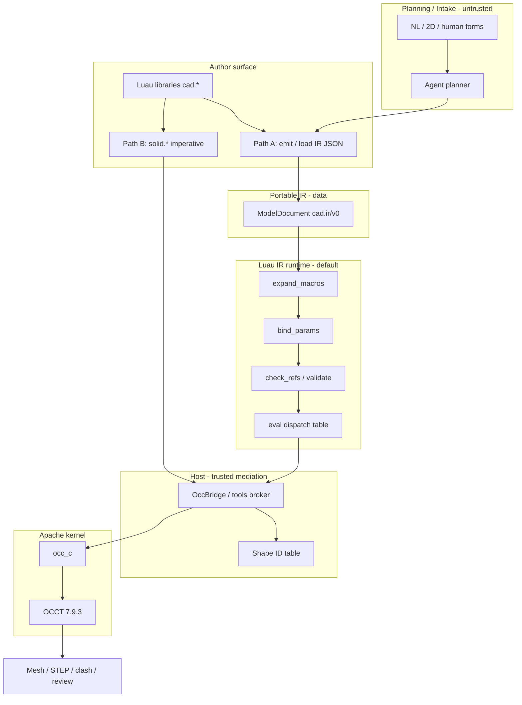
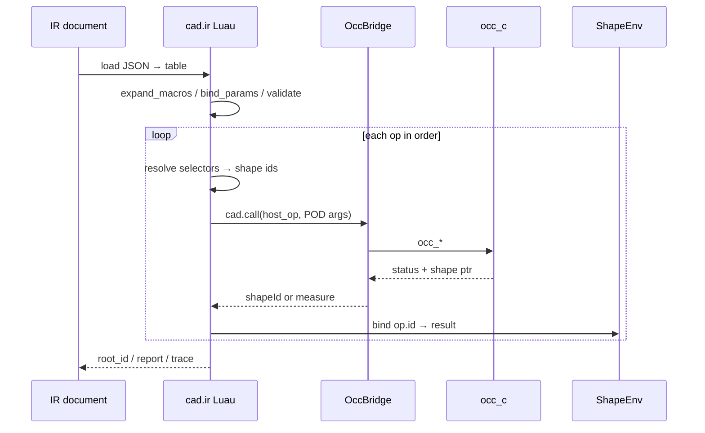

# Portable CAD IR (v0) — Full System Design

| Field | Value |
|-------|-------|
| **Document title** | Portable CAD Intermediate Representation (IR) v0 |
| **Author** | Design agent (opencascade-bazel) |
| **Date** | 2026-08-01 |
| **Status** | Ready for implementation (design review complete; open questions resolved) |
| **Revision** | 2026-08-01r3 — open Q decisions: hash sort, eval_pose, MEMFS export, Luau-first validate |
| **Schema id** | `cad.ir/v0` |
| **Audience** | Senior engineers and agents implementing Path A IR eval |
| **Authority** | Subordinate to [`SYSTEM.md`](../SYSTEM.md); sketch process subordinate to [`docs/sketch-solve-constitution.md`](sketch-solve-constitution.md) |
| **Related** | [`docs/cleanroom-featurescript-std-report.md`](cleanroom-featurescript-std-report.md) §8–§10 · [`docs/cleanroom-solvespace-sketch-solve-report.md`](cleanroom-solvespace-sketch-solve-report.md) §8 · [`AGENTS.md`](../AGENTS.md) · [`api/include/occ_c*.h`](../api/include/) · [`agent-os/src/occ-bridge.js`](../agent-os/src/occ-bridge.js) |

### Amendment 2026-08-02: solid authoring is always IR tape

**K3 Path B dual-path for solid is superseded.** Product law: Luau `solid.*` **always** records a `cad.ir` tape and evaluates through the IR runtime → host → `occ_c`. There is no direct-host “Path B” geometry surface for solid authoring. Path A (emit/load IR documents) remains the strategic spine. **`route` / `frames`** batteries may still call host tools directly; they are not solid Path B. Sections below that still contrast “Path B: imperative solid.*” vs Path A are historical design context — implement against this amendment and [`SYSTEM.md`](../SYSTEM.md) §3.1 / §4.7.

---

## Overview

This document defines the **portable CAD Intermediate Representation (IR)** for the opencascade-bazel product: a versioned, serializable op graph that agents and humans can inspect, diff, re-parameterize, and evaluate deterministically. The IR is the strategic “LLVM of CAD”: not a second solid kernel and not a Luau dialect, but **data** that lowers through a **Luau IR runtime** into allowlisted host tools, then into Apache **`occ_c`** and OCCT 7.9.3.

**v0 is intentionally minimal and implementable.** It freezes a document envelope, op node shape, value model, a small closed op catalog that covers dual-goal Path A demos (AI-BOOST pipe skid + 6-DOF robot FK/place) using **existing** `occ_c` symbols, a selector subset, JSON serialization rules, security and observability contracts, and an incremental PR plan. Sketch2D/SolveSketch, full FeatureScript-scale queries, catalogs, and mate solvers are **extension layers** — documented as deferred, not required for v0 golden demos. Dual-goal smokes stay on **ExplicitCoords** profiles; IR v0 must not require Newton.

---

## Background & Motivation

### Current state

| Layer | Status (2026-08-01) |
|-------|---------------------|
| Apache `occ_c` | Rich solid spine (**200+** `OCC_API` entry points across `api/include/occ_c*.h`; not an exact ABI census — see `scripts/gen_occ_exports.py`): prims, booleans, sweeps, route/pipe, patterns, holes, frames, compose_chain, clash, session history v0 |
| Pure-C dual-goal smokes | `//examples:smoke_pipe_skid`, `//examples:smoke_robot_6dof`, flange, session |
| AgentOS Path B | `agent-os/src/batteries/solid.luau` → `tools.call("host.org.main.cad.call")` → [`OccBridge.call`](../agent-os/src/occ-bridge.js) → partial subset of `occ_*` |
| Portable IR | **Not a first-class artifact** — highest product novelty gap (`SYSTEM.md` §12.2, FS cleanroom §13) |

Path B proves the trust boundary and browser mesh path. It does **not** give agents a reviewable compile target, deterministic goldens, or human rework as “edit this op_id / param.”

### Pain points IR solves

1. **Hallucinated free-form scripts** — agents invent control flow and topology indices that do not re-eval.
2. **No portable audit trail** — competition explainability / rework KPIs need failed `op_id` + params.
3. **Bridge lag opacity** — guest batteries expose fewer ops than `occ_c`; IR makes the **required host surface** explicit.
4. **Pose vs topology conflation** — robot joint angles must not re-extrude links; IR encodes `ComposeChain` / transform-only pose.

### Binding stack (do not reverse)

```text
  Human / agent intent
        │
        ▼
  Luau + conventions + libraries     ← author surface (not a dialect brand)
        │  Path A: emit/load IR     Path B: imperative solid.*
        ▼
  Portable CAD IR (data)            ← this document
        │
        ▼
  Luau IR runtime (default evaluator)
        │  allowlisted host tools
        ▼
  Host bridge (shape IDs only) → occ_c → OCCT
```

From [`SYSTEM.md`](../SYSTEM.md) §3.1 / §4.7: **IR is data; Luau is the default evaluator.** Geometry only in `occ_c`. Guest never holds OCCT pointers.

---

## Goals & Non-Goals

### Goals (v0)

1. **Freeze `cad.ir/v0` document + op schemas** enough for goldens and agent emission.
2. **Closed op catalog** that covers:
   - Box-cut-cylinder (Path B parity).
   - Pipe skid slice: route + annulus + clash (mirrors `smoke_pipe_skid.c`).
   - Simple 6-DOF place: link solids + frames + `ComposeChain` + rigid place (mirrors `smoke_robot_6dof.c`).
3. **Default eval path** in Luau (`cad.ir` passes + dispatch) under AgentOS; optional batch walker later.
4. **Determinism**: same document + same kernel/lib pins → same BRep within OCCT tolerances.
5. **Security**: IR contains no executable code; only allowlisted ops lower to host.
6. **Incremental implementation** via ordered PRs (see PR Plan).

### Non-goals (v0)

| Non-goal | Why |
|----------|-----|
| FeatureScript / Parasolid parity | Wrong kernel; strategic own-goal |
| Full query zoo (adjacency, tracking watermarks) | Expand selectors by need |
| Sketch2D + SolveSketch as demo gate | Constitution: ExplicitCoords only for dual-goal smokes |
| Mate solver / URDF writer / fittings catalog | Product layers outside thin IR core |
| Native IR VM as product default | Optional for CI; Luau remains default |
| Requiring `occ_session` for all evals | Freestanding shape env is enough for v0 |
| Arbitrary expressions / Lua code in IR | Closed param-ref model only |
| SI↔UI unit tables in the IR document | Conversion at authoring edges |
| Claiming “IR **is** Luau source” | Hurts non-Luau agents and file goldens |

---

## Key Decisions

| # | Decision | Rationale |
|---|----------|-----------|
| **K1** | IR is **JSON-serializable data**, not a Luau dialect or AST | Portable for agents, goldens, human review; Luau only *evaluates* tables |
| **K2** | Default evaluator is **Luau** (`cad.ir.*`); host/`occ_c` never interpret IR | One sandbox, same tool boundary as Path B; customization in libraries |
| **K3** | Path A and Path B both remain legal; Path B may **tape** into IR | Demos stay fast; IR is the strategic spine |
| **K4** | Op names are **ours** (`PrimBox`, `BoolCombine`, `RoutePath`, …) | Not FS clone; maps cleanly to recipes in clean-room reports |
| **K5** | Ops are **strings** in JSON with a versioned allowlist registry | Extensible without renumbering enums; unknown op → hard error |
| **K6** | v0 evaluation is an **ordered list** (document order); optional `deps` for validation only | Matches feature-history mental model; DAG topo is v0.1 if needed |
| **K7** | **SI store** at IR boundary (m, rad); no dual unit fields on ops | Matches `occ_c` and smoke demos |
| **K8** | Freestanding selectors: **`created_by` / `body` / `wire` / `frame` only**; face filters & set-ops only in **session mode** (PR10); indices only after materialize | Persistent refs without promising non-runnable face filters to agents |
| **K9** | v0 shape env is **freestanding** (op_id → shape ID); session optional | Implementable without host session bridge lag |
| **K10** | Sketch ops are **extension** (`Sketch2D`/`SolveSketch`); v0 profiles use **ExplicitCoords** construct ops | Constitution: do not block demos on Newton |
| **K11** | Param values: literals + `{ "param": "name" }` only; **no free expressions** in v0 | Closed security surface; agents edit params map |
| **K12** | License: schema/docs **Apache-friendly under `docs/`**; Luau runtime under **`agent-os/` (BSL)** | Apache consumers never need AgentOS |
| **K13** | Failure always reports **`op_id` + host message** | Competition explainability / rework |
| **K14** | Bridge growth follows IR catalog, not curiosity | Explicit lag table; grow OccBridge to unlock ops already in `occ_c` |
| **K15** | Validate-time **host-ready** check: op in IR registry ∧ (host lowerer registered **or** lowerer is documented **pure POD / no host**); missing required host → `IR_ERR_HOST_UNAVAILABLE`. Optional host helpers (e.g. `frame_from_axes` for `AttachFrame`) are **not** required. | Prevents mysterious host failures; pure-POD ops (freestanding `AttachFrame`) always pass host-ready |
| **K16** | Goldens assert **measures / frames / TCP**, never absolute guest shape ids | OccBridge `nextId` is process-ephemeral |
| **K17** | Full eval starts with **empty env + host `freeAll`**; intermediates stay live until eval end; no mid-doc GC in v0 | Simple ref model; matches keeping `eqA` + `eqA_place`; avoids use-after-free on `created_by` |
| **K18** | **Hash canonical form** uses **strict lexicographic** object key sort at every level; pretty on-disk files may use human key order and whitespace | Goldens hash (or store hash of) canonical form only — pretty ≠ hash input |
| **K19** | Pose-only re-eval is explicit **`cad.ir.eval_pose(doc, env, pose_params)`** — re-runs only pose path (`ComposeChain` + place `RigidXform`); automatic dirty tracking deferred | Clear caller contract for robot θ updates without full BREP rebuild |
| **K20** | Browser **`ExportBrep` / STEP write is MEMFS-only in v0**; user download is host UI later | Matches Emscripten FS; no download bridge in kernel/IR eval |
| **K21** | **`cad.ir.validate` is Luau-first** and the product validator; optional JSON Schema file is for external tools only — **not** a PR1 CI requirement | One truth path in guest; schema file may lag |

---

## Proposed Design

### Architecture



### Evaluation sequence



### Layer ownership

| Piece | Owns | Does not own |
|-------|------|--------------|
| IR document | Intent: params, ops, refs, meta hashes | Geometry algorithms |
| `cad.ir` passes + eval | Transform tables; dispatch; env | BREP truth |
| Host bridge | Shape ID ↔ `occ_shape_t`; allowlist | IR schema interpretation (beyond tool names) |
| `occ_c` / OCCT | Geometry truth | Luau / IR |

---

## 1. IR Document Schema v0

### 1.1 Top-level object

JSON object (UTF-8). Conceptual fields:

```text
ModelDocument {
  ir_schema: "cad.ir/v0"          // required; exact string for v0
  id?: string                     // document identity (not uniqueness-enforced by eval)
  version: string                 // document content semver, e.g. "0.1.0"
  units: UnitsBlock               // required
  params: map<string, ParamValue> // required (may be empty object)
  catalog?: map                   // deferred; ignored by v0 eval if present
  frames?: map<string, FramePod>  // optional named frame registry (seed)
  assembly?: AssemblyBlock        // optional; ComposeChain may use subset
  ops: Op[]                       // required; ordered list
  results?: ResultsBlock          // optional; filled by eval / goldens
  meta: MetaBlock                 // required
}
```

### 1.2 Field reference

| Field | Type | Required | Notes |
|-------|------|----------|-------|
| `ir_schema` | string | yes | Must be `"cad.ir/v0"`. Unknown → refuse eval |
| `id` | string | no | Human/agent document id |
| `version` | string | yes | Document revision (not schema id) |
| `units` | object | yes | See §1.3 |
| `params` | object | yes | String keys → values (§5) |
| `catalog` | object | no | v0: **must not** be required; unknown keys warn if `strict: false` |
| `frames` | object | no | Named `FramePod` seeds before ops attach more |
| `assembly` | object | no | See §1.5; optional for solid-only docs |
| `ops` | array | yes | Ordered evaluation list |
| `results` | object | no | Eval outputs / golden expectations |
| `meta` | object | yes | Pins, hashes, goals |

### 1.3 Units block

```json
{
  "length": "meter",
  "angle": "radian",
  "store": "SI"
}
```

| Rule | Detail |
|------|--------|
| Store | Always SI: lengths in **meters**, angles in **radians** |
| `store` | Must be `"SI"` in v0 |
| UI conversion | Authoring / Monaco / params sheet convert at edges (`cad.units`); **not** stored per-op |
| Density (measures) | kg/m³ when used (e.g. mass props) — still SI |

Reject documents with `length: "mm"` as store; agents may emit mm at intake and convert before writing IR.

### 1.4 Meta block

```json
{
  "author": "agent|human|import",
  "goals": ["pipe_skid", "robot_arm"],
  "lib_versions": {
    "cad_ir": "0.1.0",
    "luau_cad": "0.1.0",
    "occ_c": "7.9.3-api",
    "occt": "7.9.3"
  },
  "kernel_version": "7.9.3",
  "created_at": "2026-08-01T00:00:00Z",
  "hashes": {
    "ir_body": "sha256:…",
    "params": "sha256:…",
    "ops": "sha256:…"
  },
  "strict": true,
  "notes": "optional free text"
}
```

| Field | Role |
|-------|------|
| `lib_versions` | Pin Luau libraries that expand macros / recipes |
| `kernel_version` / `occ_c` pin | Reproducibility for goldens |
| `hashes` | Optional; computed over **canonical JSON** of selected subtrees (§9) |
| `strict` | If true (default for goldens): unknown ops/fields fail; if false: ignore unknown extension fields |
| `goals` | Tags for dual-goal routing / filters |

**Hash inputs (v0 recommendation):**

1. Canonicalize JSON (stable key order, no insignificant whitespace variance).  
2. Hash `params` alone → `meta.hashes.params`.  
3. Hash `ops` alone → `meta.hashes.ops`.  
4. Hash entire document excluding `meta.hashes` and `results` → `meta.hashes.ir_body`.

Eval does **not** re-hash unless a pass is asked to; goldens may assert hashes.

### 1.5 Assembly block — **informative / reserved in v0**

The optional `assembly` object is a **forward-compatible authoring surface** for robot packaging. **v0 eval does not expand it.**

| Rule | Detail |
|------|--------|
| Presence | Allowed; may be omitted |
| Validate | If present: check object shape (map fields optional); do **not** require joints |
| Eval | **Ignore** for geometry. Dual-goal robot demos **must** use explicit `ComposeChain` + `RigidXform` params (example §15.3) |
| Limits | Not enforced in v0 (no clamp, no fail-on-limit) |
| Mate solver | Out of scope forever for this block alone |

Illustrative reserved shape (agents may emit for humans; macros may expand later):

```json
{
  "root": "base_occ",
  "occurrences": {
    "base_occ":  { "part": "base_part",  "parent": null },
    "link1_occ": { "part": "link1_part", "parent": "base_occ" }
  },
  "joints": [
    {
      "id": "J1",
      "type": "revolute",
      "parent": "base_occ",
      "child": "link1_occ",
      "axis_frame": "F_J1",
      "angle": { "param": "th1" },
      "limits": { "param": "lim1" }
    }
  ],
  "tcp": { "name": "tool0", "frame": "F_TCP", "occurrence": "link6_occ" }
}
```

A future `expand_assembly` pass may lower joints → packed `ComposeChain` params. **Not in v0.**

### 1.6 Results block (eval output only — not portable goldens)

```json
{
  "root": "body_cut",
  "shape_ids": { "housing": 1, "body_cut": 3 },
  "measures": {
    "clash_pipe_eqA": {
      "status": "separated",
      "status_code": 0,
      "distance": 0.12
    }
  },
  "frames": {
    "TCP": { "ox": 0.1, "oy": 0.0, "oz": 0.8 }
  },
  "trace_id": "optional"
}
```

| Field | Golden? | Notes |
|-------|---------|-------|
| `root` | yes (op_id string) | Designated root op_id |
| `shape_ids` | **no** | Eval-ephemeral debug only — OccBridge assigns monotonic ints (`nextId`); **never** assert absolute ids in goldens (K16) |
| `measures` | **yes** | Clash status, volume, bbox, TCP origin/matrix — primary golden surface |
| `frames` | **yes** | Named FramePods after eval (names, not guest ids) |

Written by evaluator; strip on re-author if desired. Keep expected measures in separate `*.golden.json` fixtures under `docs/ir/goldens/` (Apache — **decided**: see PR1).

### 1.7 Versioning policy (frozen)

| Identifier | Changes when |
|------------|--------------|
| **`ir_schema`** | **Only on breaking** changes to envelope fields, op param/ref **meaning**, or selector semantics that would mis-eval old docs. First breaking line → `cad.ir/v1`. **Do not** use `cad.ir/v0.1` as a schema string. |
| **`meta.lib_versions.cad_ir`** | Additive ops, optional fields, handler bugfixes, new optional params with defaults, bridge growth. Documents keep `ir_schema: "cad.ir/v0"`. |

| Change class | Action |
|--------------|--------|
| Additive optional document/op field; old docs still eval | Keep `cad.ir/v0`; bump `cad_ir` patch/minor |
| New op registered (unknown to old evaluators) | Keep `cad.ir/v0`; old evaluators **hard-fail** if document **uses** unknown op; docs that omit it still run |
| Semantic change to existing required param/ref | **`cad.ir/v1`** — never silent |
| Rename op | New name under same schema only with a one-release rewrite pass; prefer new op name + deprecate |

Documents **must** declare `ir_schema`. v0 evaluators accept only `"cad.ir/v0"`. Multi-schema runners are later.

---

## 2. Op Node Schema

### 2.1 Shape

```json
{
  "id": "housing",
  "op": "PrimBox",
  "params": { "dx": 0.8, "dy": 0.6, "dz": 0.9 },
  "refs": {},
  "deps": [],
  "meta": { "source": "agent", "feature": "equipment_envelope", "part": "eqA" }
}
```

| Field | Type | Required | Rules |
|-------|------|----------|-------|
| `id` | string | yes | Unique within document. Hierarchical OK: `"link2/bore"`. Pattern: `[A-Za-z_][A-Za-z0-9_./-]*` |
| `op` | string | yes | Must be in allowlist for schema version (§4) |
| `params` | object | yes | May be `{}`. Values follow value model (§5) |
| `refs` | object | no | Map of named inputs → Selector / Ref (§3) |
| `deps` | string[] | no | Op ids that must exist earlier; **v0 ordered eval does not reorder** — only validates |
| `meta` | object | no | `source`, `feature`, `part`, free tags |

### 2.2 Op enum strategy (extensibility)

- **Storage:** string op name (not integer enum) in JSON.  
- **Registry:** code table in `cad.ir.ops` (Luau) + optional Apache schema doc listing.  
- **Unknown op:** error `IR_ERR_UNKNOWN_OP` with `op` and `op_id`.  
- **Extension ops:** vendors/libraries may register under namespaced prefixes later (`ext.myorg.Foo`); **v0 core has no dots in core names**.  
- **Aliases:** none in v0 (avoid silent dual names).  

### 2.3 Identity & history

- Every mutating op that produces geometry binds `env.shapes[op.id]`.  
- Measure ops bind `env.measures[op.id]` (and optionally do not create shapes).  
- Frame-producing ops bind `env.frames[name]` and/or `env.frames_by_op[op.id]`.  
- Reuse of the same `id` is **illegal** (fail validation).  
- Abort after failure: later ops not run; prior env retained for debug.

### 2.4 Transactionality

v0 does **not** require OCCT-level undo for each op. Semantics:

1. On host/`occ_c` failure: stop; report failing `op_id`.  
2. Do not leave guest shape table half-updated for the failed op (no id binding).  
3. Optional later: wrap session `begin_op`/`end_op` when session mode enabled.

---

## 3. Selector / Ref Language v0

Selectors re-resolve **at eval time**. They are programs, not permanent face integers (`SYSTEM.md` §4.4; FS cleanroom §3.6).

### 3.1 v0 freestanding allowlist (hard — agents must emit only these)

**Mode default:** freestanding (no `occ_session`). Only the forms below are legal. Anything else → `IR_ERR_UNSUPPORTED` at validate (if recognizable) or resolve (`IR_ERR_SELECTOR`).

| Form | JSON example | Meaning |
|------|--------------|---------|
| Created-by body | `{ "created_by": "housing", "entity": "body" }` | Shape from geometry op `housing` |
| Created-by wire | `{ "created_by": "route_A", "entity": "wire" }` | Wire/spine result (same as body for route ops that produce wires) |
| Body shorthand | `{ "body": "housing" }` | ≡ created_by body |
| Op result | `{ "op": "route_A" }` | ≡ `env.shapes["route_A"]` (must be a **geometry** op — see below) |
| Frame by name | `{ "frame": "nozzleA" }` | Named SE(3) in `env.frames` |
| Measure/chain by op | `{ "op": "fk" }` only where a handler documents **non-shape** resolve (e.g. `RigidXform.refs.chain`) | Does **not** use `env.shapes` |
| List of bodies | `[ { "body": "a" }, { "body": "b" } ]` | For multi-tool booleans |
| Nth on list | `{ "nth": { "of": [ … ], "i": 0 } }` | 0-based index into an **explicit list** of freestanding refs only |

**Entity kinds legal freestanding:** `body`, `wire` only (plus `frame` via `{ "frame": name }`).

**Illegal freestanding (do not emit for dual-goal v0 demos):**

- `entity: "face"` / `"edge"` / filters (`max_area`, `planar`, …)
- Topology set ops (`union` / `intersect` / `subtract` of entity ids)
- `{ "all_solids": true }`
- Integer `face_index` as a portable ref across ops

### 3.2 Measure-only ops and refs

Ops that bind only measures/frames (`ComposeChain`, `QueryClash`, `QueryGeom`, `AttachFrame` for frames) **do not** write `env.shapes[op.id]`.

| Ref use | Resolution |
|---------|------------|
| `{ "body": "x" }` / `{ "created_by": "x", "entity": "body" }` | Requires `env.shapes[x]` — fails if `x` is measure-only |
| `{ "op": "fk" }` as `refs.chain` on `RigidXform` | Reads `env.measures["fk"]` per §4.4 (`ComposeChainMeasure`) |
| `{ "frame": "name" }` | Reads `env.frames[name]` |

### 3.3 Session mode / v0.1 (not freestanding default)

When `opts.session = true` and host exposes session query APIs, **additional** forms may be enabled:

| Form | Notes |
|------|-------|
| `{ "created_by": "op", "entity": "face", "filter": { … } }` | Face materialize + filters |
| Set ops on entity id arrays | `occ_query_union_ids` etc. |
| Filters | `max_area`, `min_area`, `planar`, `max_z`/`min_z`, `cylindrical` (AND composition) |

Until session mode ships (PR10), validators in freestanding mode **reject** face/filter/set-op selectors so planners do not emit non-runnable dual-goal IR.

### 3.4 Explicitly deferred (any mode)

| Deferred | Until |
|----------|-------|
| Adjacency / edges-of-face / ownedBy | FS A3 |
| Attribute / name tags on topology | A4 |
| Tracking watermarks | Later history |
| Spatial “contains point” selectors | Optional |
| Integer topology indices as portable refs | **Forbidden** across ops |

### 3.5 Resolution algorithm (freestanding v0)

```text
resolve_shape(sel, env):
  if sel.body: return env.shapes[sel.body] or error SELECTOR
  if sel.created_by:
    if sel.entity not in {body, wire}: error UNSUPPORTED
    return env.shapes[sel.created_by] or error SELECTOR
  if sel.op: return env.shapes[sel.op] or error SELECTOR
  if array: map resolve_shape
  if sel.nth: list = resolve_shape(sel.nth.of); return list[i] or error
  error BAD_SELECTOR

resolve_frame(sel, env):
  if sel.frame: return env.frames[sel.frame] or error SELECTOR

resolve_chain(sel, env):   -- RigidXform only
  key = sel.op or sel.chain_op
  m = env.measures[key] or error SELECTOR
  require m.kind == "compose_chain"
  return m
```

---

## 4. Core Op Catalog for v0

### 4.1 Design rule

Every registered op must lower to **`occ_c` symbols that exist today** (or pure POD math). Bridge gaps are host work. Catalog is **tiered** so allowlists and PRs stay honest.

### 4.2 Tiered catalog

#### Tier A — **v0-demo-required** (Path A dual-goal + box-cut)

Must be implementable for PR3 / PR5 / PR7 goldens. Allowlist for dual-goal demos = this set.

| IR op | Family | Primary lower | Host bridge | Demo |
|-------|--------|---------------|-------------|------|
| `PrimBox` | solid | `occ_make_box` | `make_box` **today** | box, pipe, robot |
| `PrimCylinder` | solid | `occ_make_cylinder` | `make_cylinder` **today** | box, robot |
| `BoolCombine` | boolean | `occ_fuse`/`cut`/`intersect` | `fuse`/`cut`/`intersect` **today** | box |
| `Translate` | xform | `occ_translate` | `translate` **today** | pipe |
| `Rotate` | xform | `occ_rotate` | `rotate` **today** | optional |
| `RigidXform` | xform | `occ_trsf_apply_shape` | **need** `trsf_apply` | robot |
| `RoutePath` | route | `occ_make_route_polyline` / `occ_make_route_with_bends` | **need** | pipe |
| `SweepAlong` | sweep | `occ_pipe_annulus` (annulus path) | **need** `pipe_annulus` | pipe |
| `AttachFrame` | frames | pure POD **or** `occ_frame_from_axes` | **optional** host | pipe, robot |
| `ComposeChain` | fk | `occ_compose_chain` | **need** `compose_chain` | robot |
| `QueryClash` | measure | `occ_clash` (+ optional `occ_distance`) | `clash`/`distance` **today** | pipe |
| `QueryGeom` | measure | volume / bbox | `volume`/`bbox` **today** | optional asserts |
| `ExportMesh` | io | `occ_mesh_compute` | `mesh` **today** | box + demos |

#### Tier B — **v0-registered-optional** (may register when host ready; not dual-goal blockers)

| IR op | Host | Ship with |
|-------|------|-----------|
| `PrimSphere`, `PrimCone`, `PrimTorus` | today | anytime |
| `MirrorCopy` | `mirror` today | PR12-ish |
| `PushPull` | `extrude` today | when profiles exist |
| `PatternLinear`, `PatternPolar` | today | PR12 |
| `GroupBodies` | **need** `make_compound` | PR12 |
| `ExportBrep` | **need** STEP path; browser **MEMFS-only** (K20) | PR12 |
| `MakeRectProfile`, `MakeCircleProfile`, `MakePolyline` | **need** construct | PR13 |

Validate policy for Tier B: if document uses the op, host lowerer **must** be registered or fail `IR_ERR_HOST_UNAVAILABLE` (K15). Do not claim “core complete” until Tier A is green.

#### Tier C — **extension** (not in v0 allowlist)

| Op | Notes |
|----|-------|
| `Sketch2D`, `SolveSketch` | Constitution Active Slices; ExplicitCoords until then |
| `SpinSolid`, `LoftSections`, `HollowBody`, `RoundEdge`, `BevelEdge`, `DrillHole` | C ready; later |
| `MemberSweep`, `ImportBrep`, `SpawnPart`, `MeshPrep` | Product layers |
| `Mate*`, `ExportRobotPackage`, `ParseIntent` | Outside thin eval |

### 4.3 Canonical IR → host arg lowering (naming)

**IR-canonical forms** (JSON documents and agents should emit these). Handlers lower to OccBridge flat args (matching `solid.luau` dual acceptance).

| IR form | Host args |
|---------|-----------|
| `origin: [x,y,z]` | `cx, cy, cz` |
| `axis: [x,y,z]` | `ax, ay, az` |
| `angle` (radians) | `angle` / `angle_rad` (same SI rad) |
| `nodes: [[x,y,z], …]` | flat `Float64` length `3n` + `n_points` |

Do not require agents to emit `cx`/`ax` flat keys; handlers may accept them as aliases for Path B tape convergence (PR11 additive only).

### 4.4 Op parameter contracts — Tier A (normative)

Each table: **params**, **refs**, **binds**, **host**, **errors**.

#### `PrimBox` → geometry

```json
{ "id": "base", "op": "PrimBox",
  "params": { "dx": 3.0, "dy": 1.5, "dz": 0.1, "corner": "origin" } }
```

| Item | Spec |
|------|------|
| Required params | `dx`, `dy`, `dz` (m, > 0) |
| Optional | `corner`: `"origin"` (default) \| `"centered_xy_bottom"` (post-make `Translate` −dx/2,−dy/2,0) |
| Refs | none |
| Binds | `env.shapes[id]` new shape |
| Host | `make_box` then optional `translate` |
| Errors | `IR_ERR_VALIDATE` if non-positive size |

#### `PrimCylinder` → geometry

```json
{ "params": {
    "radius": 0.05, "height": 0.45,
    "origin": [0,0,0], "axis": [0,0,1]
}}
```

| Item | Spec |
|------|------|
| Required | `radius` > 0, `height` > 0 (m) |
| Optional | `origin` default `[0,0,0]`; `axis` default `[0,0,1]` (non-zero) |
| Host | `make_cylinder` with lowered `cx…az` |
| Binds | `env.shapes[id]` |

#### `BoolCombine` → geometry

```json
{ "params": { "mode": "subtract" },
  "refs": {
    "target": { "body": "a" },
    "tools":  [{ "body": "b" }]
  }}
```

| Item | Spec |
|------|------|
| Required params | `mode`: `"union"` \| `"subtract"` \| `"intersect"` |
| Required refs | `target` (one shape); `tools` (array length ≥ 1) |
| Fold | **Left-fold sequential**: `acc0 = target`; for each tool: `acc = host(acc, tool)`. Host: `fuse` / `cut` / `intersect` per mode. Do **not** require `fuse_many`/`cut_many` in v0. |
| Inputs | Non-consuming at C layer; prior env ids remain valid (lifetime §6.4) |
| Binds | `env.shapes[id]` = final `acc` |
| Errors | bad mode → `IR_ERR_VALIDATE`; empty tools → `IR_ERR_VALIDATE` |

#### `Translate` → geometry

```json
{ "params": { "dx": 1.0, "dy": 0.0, "dz": 0.1 },
  "refs": { "shape": { "body": "eqA" } } }
```

| Item | Spec |
|------|------|
| Required | `dx,dy,dz` (m); `refs.shape` |
| Host | `translate` |
| Binds | **new** `env.shapes[id]`; source shape **kept** |

#### `Rotate` → geometry

```json
{ "params": {
    "origin": [0,0,0], "axis": [0,0,1], "angle": 1.57079632679
  },
  "refs": { "shape": { "body": "part" } } }
```

| Item | Spec |
|------|------|
| Required | `angle` (rad); `refs.shape` |
| Optional | `origin` default 0; `axis` default `[0,0,1]` |
| Host | `rotate` (`px,py,pz,ax,ay,az,angle`) |
| Note | IR name is `angle` only (radians). Alias `angle_rad` accepted in handler for Path B tape. |

#### `AttachFrame` → **frame only** (no shape)

```json
{ "params": {
    "name": "nozzleA",
    "origin": [-0.5, 0, 0.55],
    "x": [0,0,1],
    "z": [1,0,0]
  }
}
```

| Item | Spec |
|------|------|
| Required | `name` (string); `origin` Vec3; `z` Vec3 non-zero |
| Optional | `x` Vec3 hint (default auto); if both `x` and `z`, Y = z×x orthonormalized |
| Host | **Freestanding default: pure Luau/POD** — no bridge call required. Optional host `frame_from_axes` for orthonormalize parity with C. |
| Binds | `env.frames[name]` = FramePod; **does not** set `env.shapes[id]` |
| Face attach | **Unsupported** freestanding → `IR_ERR_UNSUPPORTED` |

#### `RoutePath` → geometry (wire)

```json
{ "params": {
    "style": "polyline_bend",
    "bend_r": 0.15,
    "nodes": [[x,y,z], ...],
    "closed": false
}}
```

| Item | Spec |
|------|------|
| Required | `nodes` array length ≥ 2 of Vec3 |
| `style` | `"polyline"` → `occ_make_route_polyline`; `"polyline_bend"` → `occ_make_route_with_bends` (requires `bend_r` ≥ 0) |
| `closed` | default false |
| Caps | `nodes.length` ≤ `opts.limits.route_nodes` (default 512) |
| Host | `make_route` / `make_route_bends` (§8.4) |
| Binds | `env.shapes[id]` wire |

#### `SweepAlong` → geometry (annulus solid)

```json
{ "params": {
    "profile_kind": "annulus",
    "od": 0.1143,
    "inner": 0.1023
  },
  "refs": { "path": { "created_by": "route_A", "entity": "wire" } }
}
```

| Item | Spec |
|------|------|
| `profile_kind` | v0 demo path: **`"annulus"` only** required. (`"shape"` + `refs.profile` is Tier B when profile ops land.) |
| Required (annulus) | **`od > inner > 0`** (m) — matches `occ_pipe_annulus` (both diameters > 0 and id < od). Validate-time `IR_ERR_VALIDATE` if violated (do not wait for host). Canonical name **`inner`** for inner diameter (not op-field `id`). Alias `inner_diameter` accepted. **Reject** bare param key `id` for diameter in schema docs. |
| Refs | `path` → wire shape |
| Host | `pipe_annulus` → `occ_pipe_annulus(od, inner, spine, out)` |
| Binds | `env.shapes[id]` solid |

#### `ComposeChain` → **measure only** (no shape)

Semantics match [`occ_compose_chain`](../api/include/occ_c_trsf.h) and [`smoke_robot_6dof.c`](../examples/smoke_robot_6dof.c):

```text
origins: n×3, axes: n×3, angles: n radians
out_world_frames[k] = world pose after joint k  (0-based k = 0..n-1)
out_final_4x4 = pose after joint n-1
```

```json
{ "id": "fk", "op": "ComposeChain",
  "params": {
    "origins": [[0,0,0],[0,0,0.15],...],
    "axes": [[0,0,1],[0,1,0],...],
    "angles": [0.35, -0.6, ...]
  }
}
```

| Item | Spec |
|------|------|
| Required | `origins` (n Vec3), `axes` (n Vec3), `angles` (n numbers/param-refs); `n ≥ 1`; lengths equal |
| **Does not** | Bind `env.shapes["fk"]` |
| **Does not** | Read `document.assembly` in v0 |
| Host | `compose_chain` (§8.4) |
| **Normative bind** | `env.measures[id] = ComposeChainMeasure` (below) |
| Also | Optionally mirror `env.frames[id ++ "/" ++ k]` as FramePod for k=0..n-1 and `env.frames[id ++ "/final"]` — **optional**; `RigidXform` must not require frames if measure present |

**`ComposeChainMeasure` POD (normative):**

```json
{
  "kind": "compose_chain",
  "n": 6,
  "prefixes": [ /* n arrays of 16 numbers, row-major 4×4 */ ],
  "final": [ /* 16 numbers, same as prefixes[n-1] */ ]
}
```

| Field | Meaning |
|-------|---------|
| `prefixes[k]` | World 4×4 after joint `k` (0-based) — same as C `T_prefix[k]` / `out_world_frames[k]` converted via `occ_frame_to_matrix4x4` |
| `final` | TCP / end pose = `prefixes[n-1]` |

Index base: **0-based**. `prefix_index: 0` = first joint pose (after joint 0).

#### `RigidXform` → geometry

Two mutually exclusive modes:

**Mode A — explicit matrix**

```json
{ "params": { "matrix4x4": [ /* 16 */ ] },
  "refs": { "shape": { "body": "link2" } } }
```

**Mode B — chain prefix place (robot)**

```json
{ "params": { "prefix_index": 0 },
  "refs": {
    "shape": { "body": "link0" },
    "chain": { "op": "fk" }
  }
}
```

| Item | Spec |
|------|------|
| Mode A | `params.matrix4x4` length 16; host `trsf_apply` → `occ_trsf_apply_shape` |
| Mode B | `params.prefix_index` integer 0..n-1; `refs.chain` resolves to `ComposeChainMeasure` via `env.measures[op]`; matrix = `measure.prefixes[prefix_index]`; same host apply |
| Required refs | `shape` always |
| Binds | **new** `env.shapes[id]`; source kept |
| Errors | missing measure → `IR_ERR_SELECTOR`; index OOB → `IR_ERR_VALIDATE`; no matrix and no chain → `IR_ERR_VALIDATE` |
| Parity | Same geometric result as smoke: build local link at origin, apply prefix world matrix |

#### `QueryClash` → **measure only**

Verified: `occ_clash` writes **status only** (`OCC_CLASH_SEPARATED=0`, `CLEARANCE=1`, `INTERFERE=2`). Distance is a **separate** `occ_distance` call. Bridge `#clash` returns `{ status, name }`; `#distance` returns `{ distance, pointOnA, pointOnB }`.

```json
{ "params": {
    "clearance": 0.025,
    "include_distance": true
  },
  "refs": { "a": { "body": "pipe_A" }, "b": { "body": "eqA_place" } }
}
```

| Item | Spec |
|------|------|
| Required refs | `a`, `b` shapes |
| `clearance` | m, default 0 |
| `include_distance` | bool, **default `true` for goldens**; if true, after clash call `distance` once |
| Host | `clash` then optional `distance` |
| Binds | `env.measures[id]` only — **no** `env.shapes` |

**Normative measure POD:**

```json
{
  "kind": "clash",
  "status": "separated",
  "status_code": 0,
  "distance": 0.12
}
```

| Field | Rule |
|-------|------|
| `status_code` | `0\|1\|2` exact `occ_clash_status_t` / bridge `status` |
| `status` | string map: `0→"separated"`, `1→"clearance"`, `2→"interfere"` (lowercase; bridge `name` is `SEPARATED` etc. — **normalize to lowercase IR strings**) |
| `distance` | meters; present iff `include_distance` true **and** distance call OK; if distance fails, fail whole op `IR_ERR_HOST` unless `params.distance_optional: true` (then omit field) |
| Points | not in v0 measure POD (host may log) |

Goldens assert `status` and/or `status_code`; assert `distance` only when `include_distance` was true.

#### `QueryGeom` → measure only

```json
{ "params": { "mode": "volume" },
  "refs": { "shape": { "body": "pipe_A" } } }
```

| `mode` | Host | Measure fields |
|--------|------|----------------|
| `"volume"` | `volume` | `{ "kind":"geom", "mode":"volume", "volume": number }` m³ |
| `"bbox"` | `bbox` | `{ "kind":"geom", "mode":"bbox", "bbox": { "min":[3], "max":[3] } }` |

Unknown mode → `IR_ERR_VALIDATE`.

#### `ExportMesh` → measure / side payload (no BREP shape)

```json
{ "params": { "deflection": 0.001 },
  "refs": { "shape": { "body": "body_cut" } } }
```

| Item | Spec |
|------|------|
| Host | `mesh` → vertex/index arrays (guest-safe POD), same as Path B |
| Binds | `env.measures[id] = { kind:"mesh", deflection, /* optional stats */ }`; does **not** put mesh pointers in guest long-term |
| Viewer path | See §7.7 `cad.ir.run_demo` — marker carries root **shape id**; AgentOS host remeshes after Luau (same as `solid.finish`) |

### 4.5 Coverage vs dual-goal Path A

```text
Box-cut:     PrimBox, PrimCylinder, BoolCombine, ExportMesh
Pipe skid:   PrimBox, Translate, AttachFrame, RoutePath,
             SweepAlong(annulus), QueryClash, ExportMesh
Robot FK:    PrimBox, PrimCylinder, ComposeChain, RigidXform,
             ExportMesh
```

Optional: `QueryGeom` for volume golden. No Sketch2D. No `assembly` expansion. No PatternLinear required for pipe slice (C smoke clamps are optional).

---

## 5. Value Model

### 5.1 JSON types allowed in params

| Kind | JSON | Notes |
|------|------|-------|
| Number | `3.14` | Finite; SI |
| Bool | `true`/`false` | |
| String | `"union"` | Enums as strings |
| Null | not used | Prefer omit key |
| Array | `[…]` | Homogeneous preferred |
| Object | structured | Frames, param refs, nested |

### 5.2 Param reference

```json
{ "param": "pipe_od" }
```

- Resolves against `document.params` only (no nested scopes in v0).  
- Missing name → `IR_ERR_UNBOUND_PARAM` at bind_params pass.  
- Type must be compatible with sink (number vs array).  

**Forbidden in v0:**

- `{ "expr": "a + b" }`  
- Luau snippets  
- Cross-op measure refs as values (use a prior `QueryGeom` + param write only if a pass supports it — not in v0 core)

### 5.3 Quantities

v0 stores **bare SI numbers**. Optional future:

```json
{ "value": 0.15, "dim": "length" }
```

Not required; if present, `dim` must match expected dimension of the field.

### 5.4 Arrays & frames as POD

**Vec3:** `[x, y, z]` numbers (or param refs per component not required — whole array may be a param).

**FramePod** (matches mental model of `occ_frame_t`):

```json
{
  "ox": 0, "oy": 0, "oz": 0,
  "xx": 1, "xy": 0, "xz": 0,
  "yx": 0, "yy": 1, "yz": 0,
  "zx": 0, "zy": 0, "zz": 1
}
```

Shorthand accepted by bind pass:

```json
{ "origin": [0,0,0], "x": [1,0,0], "z": [0,0,1] }
```

Y reconstructed as `z × x` (same as frames module).

**Mat4:** 16-number row-major array, last row `0,0,0,1`.

### 5.5 Params map values

```json
"params": {
  "pipe_od": 0.1143,
  "th1": 0.35,
  "lim1": [-3.14159, 3.14159],
  "enabled_clash": true,
  "line_tag": "A"
}
```

---

## 6. Evaluation Semantics

### 6.1 Ordered list (v0)

1. **Host prep:** `freeAll` on shape table (K17).  
2. Passes: `expand_macros` → `bind_params` → `validate` (limits counts + host-ready).  
3. Create empty `EvalEnv`.  
4. For each op in document order: resolve refs → dispatch → bind on success; stop on failure (failed op does **not** bind).  
5. Next full eval always restarts at step 1.

`deps`: each dep must appear **earlier** or `IR_ERR_DEP_ORDER`. No reorder in v0.

### 6.2 DAG note

Parallel DAG eval is **out of scope for v0**. Linearization by deps is possible later. Interchange default remains ordered list.

### 6.3 Idempotence

| Property | Expectation |
|----------|-------------|
| Pure re-eval | Same document + pins → same BRep within OCCT tolerance |
| Between full evals | **Always** `freeAll` + empty env |
| Full walk | Default `cad.ir.eval` always full document order |
| Pose-only | **`cad.ir.eval_pose`** (K19) — see §6.8; not automatic dirty tracking |

### 6.4 Shape environment and lifetime (normative)

```text
EvalEnv {
  shapes:   map<op_id, guest_shape_id>   -- geometry ops only
  frames:   map<name, FramePod>
  measures: map<op_id, JSON-POD>         -- ComposeChain, Query*, ExportMesh meta
  host:     HostHandle
  trace:    TraceEvent[]
}
```

| Rule | Detail |
|------|--------|
| Start | Empty maps + host `freeAll` |
| Geometry success | Host adopts **new** id; bind `env.shapes[op.id]`; **do not** free inputs |
| Intermediate retention | All successful geometry ids live until eval end (`eqA` + `eqA_place` both remain) |
| Measure-only | No shape bind |
| Failed op | No new bind; prior binds remain for debug |
| Mid-doc GC | **Not in v0** |
| Mesh buffers | `mesh` returns **POD arrays**; no long-lived mesh pointer in guest |
| Who frees | Host `free` / `freeAll` only |

### 6.5 Failure reporting

```json
{
  "ok": false,
  "error": {
    "code": "IR_ERR_HOST",
    "op_id": "pipe_A",
    "op": "SweepAlong",
    "message": "occ_pipe_annulus failed (3): …",
    "param": null,
    "host_status": 3
  },
  "env_partial": true
}
```

| Code | Meaning |
|------|---------|
| `IR_ERR_SCHEMA` | Bad envelope / missing fields |
| `IR_ERR_UNKNOWN_OP` | Op not in IR registry |
| `IR_ERR_HOST_UNAVAILABLE` | Op known but host lowerer missing (K15) |
| `IR_ERR_UNBOUND_PARAM` | Param ref missing |
| `IR_ERR_SELECTOR` | Ref resolution failed |
| `IR_ERR_DEP_ORDER` | deps violate order |
| `IR_ERR_HOST` | `occ_*` / bridge failure |
| `IR_ERR_VALIDATE` | Enums, ranges, OOB index |
| `IR_ERR_LIMIT` | Caps exceeded |
| `IR_ERR_UNSUPPORTED` | Deferred for mode (e.g. face selector freestanding) |

### 6.6 Success result

```json
{
  "ok": true,
  "root": "body_cut",
  "shapes": { "housing": 1, "body_cut": 3 },
  "measures": {
    "clash_pipe_eqA": {
      "kind": "clash", "status": "separated", "status_code": 0, "distance": 0.12
    }
  },
  "frames": {},
  "trace": []
}
```

`shapes` is debug-only (K16). Goldens use `measures` / `frames` / root **op_id**.

### 6.7 Limits enforcement

Defaults from Appendix B; override with `opts.limits`:

```text
max_ops: 4096, route_nodes: 512, pattern_count: 256,
max_params: 2048, max_ref_depth: 16,
wall_clock_ms: 120000, per_op_ms: 30000
```

| When | Check |
|------|-------|
| `validate` | ops length, params size, route node counts, ref depth |
| `eval` | wall-clock; optional per-op timer; pattern counts |
| Exceed | `IR_ERR_LIMIT` naming the cap |

### 6.8 Pose-only re-eval — `cad.ir.eval_pose` (K19)

For robot joint-angle updates without rebuilding link BREPs:

```text
cad.ir.eval_pose(doc, prior_env, pose_params, opts?) -> Result
```

| Item | Spec |
|------|------|
| **Preconditions** | `prior_env` from a successful full `cad.ir.eval` of the same document topology (same op ids / geometry shapes still live in host table). Caller must not have `freeAll`'d those shapes. |
| **`pose_params`** | Map of param names → new SI values (typically `th0`…`th5`); merged over `doc.params` for bind of pose ops only |
| **Which ops re-run** | Only ops whose `op` is `ComposeChain`, or `RigidXform` in **mode B** (chain prefix place). All other ops **skipped**; their `env.shapes` / frames from geometry ops reused |
| **Does not** | Re-run `Prim*`, `BoolCombine`, `RoutePath`, `SweepAlong`, `QueryClash`, etc. |
| **Host** | Does **not** call `freeAll` at start; may free **previous place outputs** for re-bound place op ids if re-creating shapes |
| **Automatic dirty** | **Deferred** — caller decides when to call `eval_pose` vs full `eval` |
| **Failure** | Same error codes; if prior env missing a required shape id → `IR_ERR_SELECTOR` / `IR_ERR_VALIDATE` |

Full `cad.ir.eval` remains correct anytime; `eval_pose` is a performance path for dual-goal robot demos.

---

## 7. Luau IR Runtime

### 7.1 Module placement

| Artifact | Path / license |
|----------|----------------|
| Schema & this design | `docs/` (Apache) |
| JSON examples + goldens | **`docs/ir/examples/`**, **`docs/ir/goldens/`** (Apache) — **decided** for dual-goal parity with C smokes |
| JSON Schema | `docs/ir/cad.ir.v0.schema.json` (Apache) |
| `cad.ir` Luau runtime | `agent-os/src/batteries/ir/` (BSL) |

**Suggested Luau file map:**

```text
agent-os/src/batteries/ir/
  init.luau          -- re-exports cad.ir public API
  load.luau          -- JSON string → table (via require("json"))
  bind.luau          -- deep param bind
  validate.luau
  eval.luau
  resolve.luau       -- freestanding selectors
  ops/
    prims.luau
    boolean.luau
    xform.luau
    route.luau
    measure.luau
    chain.luau
  limits.luau
  demo.luau          -- run_demo / Path B marker
```

### 7.2 Pass pipeline

```text
doc0 = cad.ir.load(json_string | table)
doc1 = cad.ir.expand_macros(doc0)   -- identity in v0
doc2 = cad.ir.bind_params(doc1)     -- deep-walk params + refs trees
doc3 = cad.ir.validate(doc2, opts)  -- schema, ids, allowlist, host-ready, limits
res  = cad.ir.eval(doc3, opts)      -- dispatch
```

### 7.3 Dispatch table

Each handler: bound literals → resolve refs → `tools.call("host.org.main.cad.call", { op = host_op, … })` → bind env.

### 7.4 Relationship to `solid.*`

Same host path as Path B. Convergence: shared host op strings; PR11 additive aliases only (no mid-flight renames during dual-goal landings).

```mermaid
flowchart LR
  solid[solid.box] --> call[cad.call]
  ir[cad.ir.eval PrimBox] --> call
  call --> bridge[OccBridge]
  bridge --> occ[occ_make_box]
```

### 7.5 Batch / non-Luau eval (optional)

Host JS or pure-C walker may eval the same JSON for CI. Must obey allowlist, SI, measure PODs. Product default: Luau.

### 7.6 Public API surface (normative for PR2/PR3)

```text
cad.ir.load(source: string | table) -> doc
  -- string: json.decode; table: shallow-clone top level
  -- does not bind params

cad.ir.expand_macros(doc) -> doc
  -- v0: return doc unchanged (clone optional)

cad.ir.bind_params(doc) -> doc
  -- Deep-walk every op.params and op.refs tree (and nested arrays/objects).
  -- Replace objects of shape { "param": "<name>" } with document.params[name].
  -- Also walk ComposeChain angles/nodes arrays and any array elements.
  -- Unbound name → error table { ok=false, code="IR_ERR_UNBOUND_PARAM", ... }
  -- Does not walk meta, id, op string fields.

cad.ir.validate(doc, opts?) -> doc
  -- ir_schema == "cad.ir/v0"
  -- unique op ids; deps order; freestanding selector allowlist
  -- each op in registry; host-ready (K15): required host lowerer registered
  --   OR lowerer is pure POD / no host (e.g. freestanding AttachFrame);
  --   optional host helpers do not block validate
  -- opts.limits / Appendix B counts
  -- returns doc or errors

cad.ir.eval(doc, opts?) -> Result
  -- Result = { ok, root?, shapes?, measures?, frames?, trace?, error? }
  -- requires bind+validate already applied (or eval calls them if opts.auto_prepare)

cad.ir.eval_pose(doc, prior_env, pose_params, opts?) -> Result
  -- K19 / §6.8: re-run ComposeChain + mode-B RigidXform only; reuse prior_env shapes
  -- pose_params: map merged into params for those ops; no freeAll of whole table

cad.ir.run_demo(doc, opts?) -> Result
  -- see §7.7

cad.ir.canonical_json(doc) -> string
  -- compact JSON, strict lexicographic keys at every object (K18); for hashing only

cad.ir.hash_body(doc) -> string
  -- sha256 (or product hash) over canonical_json of document excluding meta.hashes + results
```

**`opts` keys (v0):**

| Key | Type | Default | Role |
|-----|------|---------|------|
| `trace` | bool | false | Per-op timing events |
| `limits` | table | Appendix B | Caps |
| `root` | string? | nil | Override designated root op_id |
| `session` | bool | false | Session selectors (PR10); freestanding if false |
| `auto_prepare` | bool | true | eval runs expand→bind→validate first |
| `strict` | bool? | doc.meta.strict | Unknown fields policy |
| `mesh_in_guest` | bool | false | In-guest mesh only if no host remesh (§7.7) |

**How JSON enters the guest:**

| Path | Mechanism |
|------|-----------|
| Embedded demo | Luau table literal or string constant in battery/demo script |
| Host-provided | Host tool returns JSON string → `cad.ir.load` (future); v0 may inject via staged demo file |
| Node smoke | Read file in host JS, pass string into guest or eval on host walker |

### 7.7 Path B result contract / viewer mesh (`run_demo`)

Path B ends with `solid.finish` printing:

```text
__OCC_CAD_RESULT__{"schema":1,"root":<shapeId>,...}
```

consumed by `cad-engine.js` / `runtime-worker.js`, which already **`freeAll()` then mesh `payload.root`** after Luau exits. Marker carries a numeric **root shape id**, not mesh arrays.

**IR must not invent a second marker.** Align `run_demo` with `solid.finish` (host remeshes):

```text
cad.ir.run_demo(doc, opts) :
  res = cad.ir.eval(doc, opts)
  if not res.ok: error / print structured fail; return res
  root_op = opts.root
          or doc.results.root
          or refs.shape of last ExportMesh op (if any)
          or last geometry op id that bound env.shapes
  shape_id = res.shapes[root_op]   -- ephemeral process id only
  if shape_id missing: error IR_ERR_VALIDATE ("no root shape")
  -- Do NOT call host mesh here when the AgentOS runner remeshes from the marker
  -- (matches solid.finish). Optional: if opts.mesh_in_guest and no host remesh
  -- (batch walker), call mesh and attach stats under measures only.
  print("__OCC_CAD_RESULT__" .. json.encode({
    schema = 1,
    root = shape_id,
    ir_root = root_op,
    measures = res.measures,   -- optional debug; not required by host mesh path
  }))
  return res
```

Rules:

- Designated portable root is an **op_id string**; numeric id only at the marker boundary for the host runner.  
- Prefer an explicit trailing geometry op (or `ExportMesh` whose `refs.shape` names the solid root). `ExportMesh` in IR remains optional for goldens; it does not need to run for the demo marker path.  
- Pure `cad.ir.eval` for goldens **need not** print the marker.  
- In-guest `mesh` is **opt-in** (`opts.mesh_in_guest`) for batch paths without host remesh — not the AgentOS demo default.

---

## 8. Host Contract

### 8.1 Trust boundary

| Side | Rule |
|------|------|
| Guest / IR | Shape **IDs** only; no pointers; no FS except virtual if host grants |
| Host | Maps IDs ↔ `occ_shape_t`; checks op allowlist |
| Kernel | Geometry only |

### 8.2 Mapping table (IR → bridge → C)

| IR op | OccBridge `call` op (target name) | C symbol(s) |
|-------|-----------------------------------|-------------|
| `PrimBox` | `make_box` | `occ_make_box` |
| `PrimCylinder` | `make_cylinder` | `occ_make_cylinder` |
| `PrimSphere` | `make_sphere` | `occ_make_sphere` |
| `PrimCone` | `make_cone` | `occ_make_cone` |
| `PrimTorus` | `make_torus` | `occ_make_torus` |
| `BoolCombine` union | `fuse` | `occ_fuse` |
| `BoolCombine` subtract | `cut` | `occ_cut` |
| `BoolCombine` intersect | `intersect` | `occ_intersect` |
| `Translate` | `translate` | `occ_translate` |
| `Rotate` | `rotate` | `occ_rotate` |
| `MirrorCopy` | `mirror` | `occ_mirror` |
| `PushPull` | `extrude` | `occ_extrude_*` / simple extrude |
| `SweepAlong` pipe | `pipe` / `pipe_annulus` | `occ_pipe_solid`, `occ_pipe_annulus` |
| `RoutePath` | `make_route` / `make_route_bends` | `occ_make_route_*` |
| `AttachFrame` | `frame_from_axes` (or pure Luau POD) | `occ_frame_from_axes` |
| `ComposeChain` | `compose_chain` | `occ_compose_chain` |
| `RigidXform` | `trsf_apply` / `place_at_frame` | `occ_trsf_apply_shape`, `occ_transform_shape_frame` |
| `PatternLinear` | `pattern_linear` | `occ_pattern_linear` |
| `PatternPolar` | `pattern_polar` | `occ_pattern_polar` |
| `QueryGeom` volume | `volume` | volume API |
| `QueryGeom` bbox | `bbox` | bbox API |
| `QueryClash` | `clash` + optional `distance` | `occ_clash` + `occ_distance` |
| `ExportMesh` | `mesh` | `occ_mesh_compute` |
| `GroupBodies` | `make_compound` | `occ_make_compound` |
| `MakeCircleProfile` | `make_circle_face` / wire | `occ_make_circle_*` |
| `MakeRectProfile` | `make_rect_profile` | `occ_make_rect_profile_wire` |

### 8.3 Bridge lag (today vs need)

**Present in** [`occ-bridge.js`](../agent-os/src/occ-bridge.js):  
`make_box`, `make_cylinder`, `make_sphere`, `make_cone`, `make_torus`, `fuse`, `cut`, `intersect`, `translate`, `rotate`, `scale`, `mirror`, `extrude`, `pipe`, `fillet_all`, `pattern_linear`, `pattern_polar`, `clash`, `distance`, `volume`, `bbox`, `mesh`, `shape_free`.

**Needed for dual-goal Tier A (C + Wasm exports already present; only JS bridge + stage scripts):**

| Host op | C / export | Priority |
|---------|------------|----------|
| `make_route` / `make_route_bends` | yes | P0 pipe |
| `pipe_annulus` | yes | P0 pipe |
| `compose_chain` | yes | P0 robot |
| `trsf_apply` | yes | P0 robot |
| `frame_from_axes` (optional) | yes | optional POD in Luau |
| `make_compound` | yes | Tier B |
| STEP export | yes | Tier B |
| session queries | yes | PR10 |

**Law:** Prefer bridge growth over new C for IR v0. **Process note:** after bridge changes, restage AgentOS vendor Wasm/JS (`agent-os` stage scripts) even when exports already list symbols — stale staged `libocc_c.*` will break smokes.

### 8.4 New host op contracts (JS `call` style)

All follow existing `OccBridge.call(op, args)` → plain object return. Arrays as JS number[] (Luau tables); bridge packs to WASM heaps.

#### `make_route_bends`

```text
args: { nodes: number[] /* flat xyz* n or nested handled by Luau */, n_points: int, bend_r: number, closed?: bool }
  -- preferred flat: nodes length === 3 * n_points
return: { shapeId: number }
C: occ_make_route_with_bends(nodes, n_points, bend_r, out)
```

#### `make_route`

```text
args: { nodes: number[], n_points: int, closed?: bool }
return: { shapeId }
C: occ_make_route_polyline
```

#### `pipe_annulus`

```text
args: { od: number, inner: number, spine: shapeId }
return: { shapeId }
C: occ_pipe_annulus(od, id_bore, spine, out)  -- C param name is id; host uses `inner`
```

#### `compose_chain`

```text
args: {
  n: int,
  origins: number[],  -- length 3n, flat
  axes: number[],     -- length 3n, flat
  angles: number[],   -- length n, radians
  want_prefixes?: bool  -- default true
}
return: {
  n: int,
  prefixes: number[][],  -- n arrays of 16 (row-major 4×4); from out_world_frames via occ_frame_to_matrix4x4
  final: number[]        -- 16
}
C: occ_compose_chain(n, origins, axes, angles, frames_out, final_out)
```

Luau `ComposeChain` handler packs nested `[[x,y,z],…]` → flat arrays before call; unpacks return into `ComposeChainMeasure`.

#### `trsf_apply`

```text
args: { id: shapeId, matrix4x4: number[] /* length 16 row-major */ }
return: { shapeId }
C: occ_trsf_apply_shape(s, m, out)
```

#### `AttachFrame` (no host required freestanding)

Pure Luau: build FramePod, store `env.frames[name]`. Optional host `frame_from_axes` for C-identical orthonormalize:

```text
args: { ox,oy,oz, xx,xy,xz, zx,zy,zz }
return: { frame: { ox,oy,oz, xx,xy,xz, yx,yy,yz, zx,zy,zz } }
```

### 8.5 Units at host boundary

SI doubles unchanged. No silent mm conversion.

### 8.6 Clash / distance host (existing)

```text
clash(a, b, clearance) → { status: 0|1|2, name: "SEPARATED"|"CLEARANCE"|"INTERFERE" }
distance(a, b) → { distance, pointOnA[3], pointOnB[3] }
```

IR normalizes status strings to lowercase; may call both when `include_distance`.

### 8.7 Session relationship (optional)

| Mode | Use |
|------|-----|
| **Freestanding (default)** | body/wire/frame selectors only |
| **Session-backed** | face filters; `begin_op`/`end_op` with IR op.id |

v0 demos must not require session.

---

## 9. Serialization

### 9.1 Canonical JSON form (K18)

Two representations:

| Form | Key order | Whitespace | Use |
|------|-----------|------------|-----|
| **Hash canonical** | **Strict lexicographic** sort of object keys at **every** level | Compact (no insignificant whitespace) | `cad.ir.canonical_json` / `hash_body`; golden hash asserts |
| **Pretty / human** | Recommended human order (below); may differ from lex | Pretty-print OK | On-disk examples, agent review, diffs |

| Rule | Detail |
|------|--------|
| Encoding | UTF-8 |
| Numbers | Finite; no NaN/Infinity |
| Arrays | Preserve order (ops order is semantic) — **not** sorted |
| Hash input | Always the **hash canonical** form of the selected subtree; pretty files may store `meta.hashes.ir_body` computed from canonical, and/or a separate `*.canonical.json` fixture |
| Schema field | Pretty files: put `ir_schema` first for humans; hash form still lex-sorts keys |

**Recommended key order for pretty top-level** (human diffs only — **not** the hash order):  
`ir_schema`, `id`, `version`, `units`, `params`, `frames`, `assembly`, `ops`, `results`, `meta`.

Within each pretty op: `id`, `op`, `params`, `refs`, `deps`, `meta`.

### 9.2 File extension

`.cad.json` or `.ir.json` — recommendation: **`*.cad.json`**.

### 9.3 Golden test strategy

1. **Schema fixtures** — valid/invalid documents; **Luau `cad.ir.validate` is authoritative** (K21). Optional `docs/ir/cad.ir.v0.schema.json` for external tools only — not PR1 CI.  
2. **Eval goldens** — IR → **measures / frames / TCP** with tolerances. **Never** absolute `shape_ids`.  
3. **Parity goldens** — same scenario as `smoke_pipe_skid.c` / `smoke_robot_6dof.c`.  
4. **Hash goldens** — hash of **strict-lex canonical** body (PR8); dual-goal PR5/PR7 may ship measure-only asserts first.  
5. **Home (decided):** `docs/ir/goldens/` + `docs/ir/examples/` (Apache).  
6. **Bazel** — `bb test` / node smoke.

| Measure | ε |
|---------|---|
| Length / bbox / TCP origin | 1e-6 m relative or 1e-7 abs |
| Volume | relative 1e-6 of magnitude |
| Angle | 1e-9 rad |
| Clash `status_code` | exact 0\|1\|2 |
| Clash `distance` | 1e-6 m when `include_distance` |

### 9.4 Diff & review

Humans review **ops array + params**. Agents should avoid reordering unrelated ops. Prefer stable ids across rewrites.

---

## 10. Extensibility

### 10.1 Adding a new core op

1. Document in schema changelog + catalog table.  
2. Implement `occ_*` if missing (Apache, pure C smoke first).  
3. Add OccBridge case + solid.* optional.  
4. Add `cad.ir` handler.  
5. Golden IR fixture.  
6. Bump `meta.lib_versions.cad_ir` minor if semantics additive.

### 10.2 Forward compatibility

| Mechanism | Behavior |
|-----------|----------|
| `meta.strict: false` | Ignore unknown **fields** on ops/document (not unknown ops) |
| Unknown **ops** | Always error (IR is a closed instruction set) |
| Namespaced ops | Future `ext.*` registry with explicit enable |
| Schema evolution | New `ir_schema` string; migration pass optional |

### 10.3 Macros vs atomic ops

- **Atomic ops** = one host/kernel call (or fixed small sequence documented as one IR op).  
- **Macros** = expand in `expand_macros` pass into atomic ops (e.g. future `RectPlate` → profiles + PushPull).  
- Expanded ops get ids `parent/macro_child` to preserve history.

v0 ships **zero required macros**; expand pass is identity.

---

## 11. Security & Privacy Considerations

### 11.1 Threat model

| Threat | Mitigation |
|--------|------------|
| Malicious IR executes code | IR has **no code**; only data ops |
| IR triggers dangerous host ops | Allowlist; no shell/FS/network tools in cad.call |
| Huge documents DoS | `opts.limits` (§6.7): ops, route nodes, patterns; wall-clock soft caps → `IR_ERR_LIMIT` |
| Path traversal on Export/Import | Host resolves paths under sandbox root only |
| Kernel bugs via wild geometry | per-op timeout guidance; catch `occ_last_error`; page stays up |
| Untrusted agent → production export | Human Run / export gate (`SYSTEM.md` §2.2) |

### 11.2 Allowlist

```text
allowed_host_ops ⊆ OccBridge switch cases
allowed_ir_ops ⊆ cad.ir registry for cad.ir/v0
```

Eval must refuse IR ops whose lowerer is not registered **or** whose host op is disabled.

### 11.3 No arbitrary code

- No `eval`, embedded Luau, or URL fetch in IR.  
- `ParseIntent` / NL are **outside** the IR document (planner produces IR).  
- Catalog spawn may only load **host-approved** catalog ids.

### 11.4 Privacy

Documents may contain industrial plant layout; treat IR files as sensitive engineering data. No telemetry of model geometry without product decision. Hashes are for integrity, not fingerprinting users.

---

## 12. Observability

### 12.1 Eval trace

Optional `opts.trace = true`:

```json
{
  "op_id": "route_A",
  "op": "RoutePath",
  "t_ms": 12.4,
  "host_op": "make_route_bends",
  "status": "ok",
  "out_shape_id": 4
}
```

### 12.2 Metrics (host) — local process only in v0

| Metric | Use |
|--------|------|
| `ir_eval_total` | Count |
| `ir_eval_fail{code}` | Failures by code |
| `ir_op_ms{op}` | Per-op timing |
| `ir_ops_count` | Document size |
| `host_cad_call_ms` | Bridge latency |

**v0 scope:** in-process counters for demo/smoke/console only. **No remote export** of metrics or geometry telemetry without an explicit product decision (§11.4).

Browser demo: console + UI status line with last failed `op_id`. Node smoke: stderr + exit code.

### 12.3 Logging

- Guest: structured error tables, not stack dumps of host.  
- Host: map `occ_last_error()` into message field.  
- Never log full mesh buffers.

### 12.4 Explainability (AI-BOOST)

Failed regen must answer: **which op_id**, **which params**, **host message**. That is the rework surface.

---

## 13. Relationship to Session / History

| Mechanism | Role in v0 |
|-----------|------------|
| `occ_session_*` | Optional accelerator for `created_by` face queries |
| IR `ops` list | **Authoritative** design history for Path A |
| Freestanding env | Default; sufficient for dual-goal IR goldens |
| Session begin/end around ops | Recommended when selector depth lands |

**Do not** require session create for `PrimBox`→`BoolCombine`→`mesh` Path A.

When both exist: session op ids **must equal** IR `op.id` strings for selector alignment.

---

## 14. Sketch IR (Deferred)

### 14.1 Law

Per [`docs/sketch-solve-constitution.md`](sketch-solve-constitution.md) and sketch cleanroom §8:

- Dual-goal demos and IR v0 goldens use **ExplicitCoords** construct ops (`MakeRectProfile`, `MakeCircleProfile`, `MakePolyline`, numeric nodes).  
- `Sketch2D` / `SolveSketch` are **optional later** ops; implementing them is depth-first under Active Slices — not IR schema breadth.  
- No GPLv3 `libslvs` link or ABI twinning.

### 14.2 Future op shapes (informative)

```json
{
  "id": "flange_sk",
  "op": "Sketch2D",
  "params": {
    "mode": "explicit",
    "frame": { "origin": [0,0,0], "z": [0,0,1], "x": [1,0,0] },
    "entities": [],
    "constraints": []
  }
}
```

```json
{ "id": "flange_solve", "op": "SolveSketch",
  "refs": { "sketch": { "op": "flange_sk" } } }
```

### 14.3 Shared lower

Both ExplicitCoords and future SolveSketch **must** lower to the same construct/wire APIs before solid ops — no second solid stack.

---

## 15. Concrete Examples (v0 JSON)

### 15.1 (a) Box cut cylinder

Implements Path B demo / classic vertical slice using ops that bridge **already** supports.

```json
{
  "ir_schema": "cad.ir/v0",
  "id": "box_cut_cyl",
  "version": "0.1.0",
  "units": { "length": "meter", "angle": "radian", "store": "SI" },
  "params": {
    "box_x": 0.10,
    "box_y": 0.10,
    "box_z": 0.10,
    "cyl_r": 0.025,
    "cyl_h": 0.12
  },
  "ops": [
    {
      "id": "housing",
      "op": "PrimBox",
      "params": {
        "dx": { "param": "box_x" },
        "dy": { "param": "box_y" },
        "dz": { "param": "box_z" }
      }
    },
    {
      "id": "cutter",
      "op": "PrimCylinder",
      "params": {
        "radius": { "param": "cyl_r" },
        "height": { "param": "cyl_h" },
        "origin": [0.05, 0.05, -0.01],
        "axis": [0, 0, 1]
      }
    },
    {
      "id": "body_cut",
      "op": "BoolCombine",
      "params": { "mode": "subtract" },
      "refs": {
        "target": { "created_by": "housing", "entity": "body" },
        "tools": [{ "created_by": "cutter", "entity": "body" }]
      }
    },
    {
      "id": "viz",
      "op": "ExportMesh",
      "params": { "deflection": 0.001 },
      "refs": { "shape": { "body": "body_cut" } }
    }
  ],
  "meta": {
    "author": "human",
    "goals": [],
    "lib_versions": { "cad_ir": "0.1.0", "occ_c": "7.9.3-api", "occt": "7.9.3" },
    "kernel_version": "7.9.3",
    "strict": true
  }
}
```

### 15.2 (b) Pipe route + annulus + clash

Mirrors [`examples/smoke_pipe_skid.c`](../examples/smoke_pipe_skid.c) intent with existing C lowers (host bridge must grow route/annulus).

```json
{
  "ir_schema": "cad.ir/v0",
  "id": "pipe_skid_slice",
  "version": "0.1.0",
  "units": { "length": "meter", "angle": "radian", "store": "SI" },
  "params": {
    "pipe_od": 0.1143,
    "pipe_id": 0.1023,
    "bend_r": 0.15,
    "clearance": 0.025
  },
  "ops": [
    {
      "id": "skid_base",
      "op": "PrimBox",
      "params": { "dx": 3.0, "dy": 1.5, "dz": 0.10, "corner": "centered_xy_bottom" }
    },
    {
      "id": "eqA",
      "op": "PrimBox",
      "params": { "dx": 0.80, "dy": 0.60, "dz": 0.90 }
    },
    {
      "id": "eqA_place",
      "op": "Translate",
      "params": { "dx": -1.30, "dy": -0.30, "dz": 0.10 },
      "refs": { "shape": { "body": "eqA" } }
    },
    {
      "id": "eqB",
      "op": "PrimBox",
      "params": { "dx": 1.00, "dy": 0.70, "dz": 1.10 }
    },
    {
      "id": "eqB_place",
      "op": "Translate",
      "params": { "dx": 0.80, "dy": 0.10, "dz": 0.10 },
      "refs": { "shape": { "body": "eqB" } }
    },
    {
      "id": "nozzleA",
      "op": "AttachFrame",
      "params": {
        "name": "nozzleA",
        "origin": [-0.50, 0.0, 0.55],
        "x": [0, 0, 1],
        "z": [1, 0, 0]
      }
    },
    {
      "id": "nozzleB",
      "op": "AttachFrame",
      "params": {
        "name": "nozzleB",
        "origin": [0.80, 0.40, 0.70],
        "x": [0, 0, 1],
        "z": [-1, 0, 0]
      }
    },
    {
      "id": "route_A",
      "op": "RoutePath",
      "params": {
        "style": "polyline_bend",
        "bend_r": { "param": "bend_r" },
        "nodes": [
          [-0.50, 0.0, 0.55],
          [-0.15, 0.0, 0.55],
          [-0.15, 0.0, 1.20],
          [0.35, 0.0, 1.20],
          [0.35, 0.40, 1.20],
          [0.35, 0.40, 0.70],
          [0.80, 0.40, 0.70]
        ]
      }
    },
    {
      "id": "pipe_A",
      "op": "SweepAlong",
      "params": {
        "profile_kind": "annulus",
        "od": { "param": "pipe_od" },
        "inner": { "param": "pipe_id" }
      },
      "refs": { "path": { "created_by": "route_A", "entity": "wire" } }
    },
    {
      "id": "clash_pipe_eqA",
      "op": "QueryClash",
      "params": {
        "clearance": { "param": "clearance" },
        "include_distance": true
      },
      "refs": {
        "a": { "body": "pipe_A" },
        "b": { "body": "eqA_place" }
      }
    },
    {
      "id": "clash_pipe_eqB",
      "op": "QueryClash",
      "params": {
        "clearance": { "param": "clearance" },
        "include_distance": true
      },
      "refs": {
        "a": { "body": "pipe_A" },
        "b": { "body": "eqB_place" }
      }
    }
  ],
  "meta": {
    "author": "agent",
    "goals": ["pipe_skid"],
    "lib_versions": { "cad_ir": "0.1.0", "occ_c": "7.9.3-api", "occt": "7.9.3" },
    "kernel_version": "7.9.3",
    "strict": true
  }
}
```

Note: node coordinates are ExplicitCoords (could be bound from nozzle frames by a future pass). Pipe ≠ structure: no `MemberSweep` required for this slice.

### 15.3 (c) Simple FK place (6-DOF)

Mirrors [`examples/smoke_robot_6dof.c`](../examples/smoke_robot_6dof.c) with transform-only pose.

```json
{
  "ir_schema": "cad.ir/v0",
  "id": "robot_6dof_slice",
  "version": "0.1.0",
  "units": { "length": "meter", "angle": "radian", "store": "SI" },
  "params": {
    "L0": 0.15, "L1": 0.45, "L2": 0.40, "L3": 0.12, "L4": 0.10, "L5": 0.08,
    "th0": 0.35, "th1": -0.60, "th2": 1.10, "th3": 0.20, "th4": -0.40, "th5": 0.80
  },
  "ops": [
    {
      "id": "link0",
      "op": "PrimBox",
      "params": { "dx": 0.20, "dy": 0.20, "dz": { "param": "L0" }, "corner": "centered_xy_bottom" }
    },
    {
      "id": "link1",
      "op": "PrimCylinder",
      "params": { "radius": 0.055, "height": { "param": "L1" }, "axis": [0, 0, 1] }
    },
    {
      "id": "link2",
      "op": "PrimCylinder",
      "params": { "radius": 0.045, "height": { "param": "L2" }, "axis": [0, 0, 1] }
    },
    {
      "id": "link3",
      "op": "PrimCylinder",
      "params": { "radius": 0.035, "height": { "param": "L3" }, "axis": [0, 0, 1] }
    },
    {
      "id": "link4",
      "op": "PrimCylinder",
      "params": { "radius": 0.030, "height": { "param": "L4" }, "axis": [0, 0, 1] }
    },
    {
      "id": "link5",
      "op": "PrimCylinder",
      "params": { "radius": 0.028, "height": { "param": "L5" }, "axis": [0, 0, 1] }
    },
    {
      "id": "fk",
      "op": "ComposeChain",
      "params": {
        "origins": [
          [0, 0, 0],
          [0, 0, 0.15],
          [0, 0, 0.45],
          [0, 0, 0.40],
          [0, 0, 0.12],
          [0, 0, 0.10]
        ],
        "axes": [
          [0, 0, 1],
          [0, 1, 0],
          [0, 1, 0],
          [0, 0, 1],
          [0, 1, 0],
          [0, 0, 1]
        ],
        "angles": [
          { "param": "th0" }, { "param": "th1" }, { "param": "th2" },
          { "param": "th3" }, { "param": "th4" }, { "param": "th5" }
        ]
      }
    },
    {
      "id": "place0",
      "op": "RigidXform",
      "params": { "prefix_index": 0 },
      "refs": { "shape": { "body": "link0" }, "chain": { "op": "fk" } }
    },
    {
      "id": "place1",
      "op": "RigidXform",
      "params": { "prefix_index": 1 },
      "refs": { "shape": { "body": "link1" }, "chain": { "op": "fk" } }
    },
    {
      "id": "place2",
      "op": "RigidXform",
      "params": { "prefix_index": 2 },
      "refs": { "shape": { "body": "link2" }, "chain": { "op": "fk" } }
    },
    {
      "id": "place3",
      "op": "RigidXform",
      "params": { "prefix_index": 3 },
      "refs": { "shape": { "body": "link3" }, "chain": { "op": "fk" } }
    },
    {
      "id": "place4",
      "op": "RigidXform",
      "params": { "prefix_index": 4 },
      "refs": { "shape": { "body": "link4" }, "chain": { "op": "fk" } }
    },
    {
      "id": "place5",
      "op": "RigidXform",
      "params": { "prefix_index": 5 },
      "refs": { "shape": { "body": "link5" }, "chain": { "op": "fk" } }
    }
  ],
  "meta": {
    "author": "human",
    "goals": ["robot_arm"],
    "lib_versions": { "cad_ir": "0.1.0", "occ_c": "7.9.3-api", "occt": "7.9.3" },
    "kernel_version": "7.9.3",
    "strict": true,
    "notes": "Link BREPs fixed; re-eval with new th* only updates ComposeChain + place"
  }
}
```

`ComposeChain` (`fk`) binds **only** `env.measures["fk"]` as `ComposeChainMeasure` (`kind`, `n`, `prefixes[0..n-1]`, `final`) — **not** `env.shapes`.  
`RigidXform` mode B reads `refs.chain → measures[op]`, selects `prefixes[prefix_index]` (0-based; same as smoke `T_prefix[k]`), applies via `trsf_apply` / `occ_trsf_apply_shape`.  
Goldens assert TCP origin from `measures.fk.final` translation (indices 3,7,11 of row-major 4×4), never guest shape ids.

---

## 16. Risks

| Risk | Severity | Mitigation |
|------|----------|------------|
| **Schema churn** before agents emit IR | High | Freeze v0 tightly; additive-only; migration passes for breaking changes |
| **Bridge lag** vs `occ_c` | High | Explicit lag table; PRs grow OccBridge before claiming Path A demos |
| **Over-specifying FS-scale IR** | High | Tier A minimal catalog; Tier B/C explicit; reject sheet metal / full query zoo |
| **Selector promises without session** | Med | Freestanding hard allowlist; face/filter → `IR_ERR_UNSUPPORTED` until PR10 |
| **Expression creep** (`expr` strings) | Med | Forbid in v0; params map is the only indirection |
| **Non-determinism / OCCT float drift** | Med | Version pins; tolerance goldens; avoid hash of raw mesh |
| **Sketch / Newton blocking demos** | Med | Constitution + ExplicitCoords law |
| **License bleed** (BSL runtime into Apache) | Med | Schema/docs Apache; runtime AgentOS; no reverse deps |
| **DAG vs order confusion** | Low | v0 ordered only; deps validation only |
| **Performance** full re-eval on robot θ | Low | Pose-only optimization as optional pass |

---

## Alternatives Considered

### A1 — Native/JS IR VM as the only evaluator

| Pros | Cons |
|------|------|
| No Luau dependency for batch | Second stack; diverges from AgentOS product path |
| | Duplicates pass logic |

**Decision:** Optional batch walker later; **default remains Luau** (`SYSTEM.md` §4.7).

### A2 — IR is Luau source AST / “serialize the script”

| Pros | Cons |
|------|------|
| Easy for Luau authors | Not portable for non-Luau agents |
| | Free control flow defeats closed audit graph |
| | Confuses syntax tooling with CAD IR |

**Decision:** Rejected. Structural Luau parse ≠ CAD IR (`SYSTEM.md` §5.5).

### A3 — Integer op opcodes + protobuf-only

| Pros | Cons |
|------|------|
| Compact, strict | Worse human review; agent friction |
| | Need codegen for every language |

**Decision:** JSON string ops for v0; binary encoding may come later with same logical schema.

### A4 — Require `occ_session` for all Path A

| Pros | Cons |
|------|------|
| Rich created_by | Blocks v0 until full session bridge |
| | Overkill for prim/boolean demos |

**Decision:** Freestanding default; session optional.

### A5 — Full FeatureScript query parity in v0

| Pros | Cons |
|------|------|
| Future-proof refs | Months of work; not dual-goal blocking |

**Decision:** Freestanding selector allowlist only; expand by measured need (FS A3).

### A6 — IR ops as 1:1 `occ_*` names (`occ_make_box`)

| Pros | Cons |
|------|------|
| Trivial bridge map; no vocabulary layer | Couples portable IR to C ABI churn; poor human/agent recipe names; fights clean-room product vocabulary (`PrimBox`, `RoutePath`) |

**Decision:** Keep **product op names** (K4). Mapping table is the ABI adapter. Optional debug tape may log host/`occ_*` names in trace only.

### A7 — DAG-only interchange (no ordered list)

| Pros | Cons |
|------|------|
| Explicit parallelism; pure dependency graph | Harder human review/diff; agents often emit history order; OCCT side effects still sequential in practice |

**Decision:** Ordered list is v0 interchange (K6). Optional `deps` validate-only; DAG topo remains later if needed.

---

## Security & Privacy Considerations

(See §11 for full threat model.) Summary:

- IR is data-only; allowlisted lowers; sandboxed guest; human export gate.  
- Cap resource bounds on routes/patterns.  
- Treat IR as sensitive engineering content.

---

## Observability

(See §12.) Summary: per-op trace, fail `op_id`, timing metrics, stderr/UI surfacing for competition explainability.

---

## Rollout Plan

### Stage 0 — Schema freeze (docs only)

- Land this design under `docs/`; examples/goldens layout under `docs/ir/`.  
- Optional JSON Schema draft for external tools only (not CI).  
- No runtime yet; agents may emit documents against the design.

### Stage 1 — Box-cut Path A

- `cad.ir` load/bind/validate/eval for prims + boolean + mesh.  
- Uses **existing** OccBridge.  
- Golden + node smoke.

### Stage 2 — Bridge growth for dual-goal

- Route, annulus, frames, compose_chain, trsf.  
- Pipe + robot IR goldens parity with C smokes.

### Stage 3 — Selectors + optional session

- Face filters where needed; still ExplicitCoords profiles.

### Stage 4 — Product layers

- Catalog, assembly packaging, MeshPrep, NL→IR (outside core schema freezes).

### Rollback

- Feature flag `cad.ir.eval` off → Path B only.  
- Schema bumps are additive; old goldens pin `ir_schema`.  
- Bridge ops are additive; disable new host ops without breaking old IR.

---

## Open Questions

**All previously open items are decided.** Record only:

| # | Topic | Decision |
|---|--------|----------|
| 1 | Golden home | Apache `docs/ir/examples/` + `docs/ir/goldens/` |
| 2 | Canonical key sort for hashes | **Strict lexicographic** for hash form only; pretty human files may differ (K18) |
| 3 | Pose-only re-eval | Explicit **`cad.ir.eval_pose`**; automatic dirty tracking deferred (K19, §6.8) |
| 4 | ExportBrep in browser | **MEMFS-only in v0**; download is host UI later (K20) |
| 5 | Assembly block | Informative/reserved; ignore at eval; explicit `ComposeChain` params |
| 6 | JSON Schema tool | **Luau-only `cad.ir.validate` first**; optional JSON Schema later for external tools — not PR1 CI (K21) |

No open product questions block PR1–PR7.

---

## References

| Document | Role |
|----------|------|
| [`SYSTEM.md`](../SYSTEM.md) | North star; Path A/B; IR is data; Luau default evaluator |
| [`AGENTS.md`](../AGENTS.md) | License boundary; C ABI laws; BuildBuddy |
| [`docs/cleanroom-featurescript-std-report.md`](cleanroom-featurescript-std-report.md) | Op catalog, selectors, dual-goal matrix, §10 IR requirements |
| [`docs/cleanroom-solvespace-sketch-solve-report.md`](cleanroom-solvespace-sketch-solve-report.md) | Sketch IR chapter; ExplicitCoords law |
| [`docs/sketch-solve-constitution.md`](sketch-solve-constitution.md) | Depth-first sketch process |
| [`api/include/occ_c.h`](../api/include/occ_c.h) + modules | Geometry contract |
| [`agent-os/src/occ-bridge.js`](../agent-os/src/occ-bridge.js) | Host allowlist reality |
| [`agent-os/src/batteries/solid.luau`](../agent-os/src/batteries/solid.luau) | Path B author surface |
| [`examples/smoke_pipe_skid.c`](../examples/smoke_pipe_skid.c) | Pipe Path A C reference |
| [`examples/smoke_robot_6dof.c`](../examples/smoke_robot_6dof.c) | Robot Path A C reference |

---

## PR Plan

Incremental, independently reviewable PRs. Dependency order is binding.

### PR1 — IR schema documentation freeze

| | |
|--|--|
| **Title** | `docs: freeze cad.ir/v0 portable IR schema` |
| **Files** | `docs/ir/README.md`, examples (box/pipe/robot), `docs/ir/goldens/` layout, `docs/README.md`, `SYSTEM.md` pointer; optional draft `cad.ir.v0.schema.json` (not CI) |
| **Deps** | None |
| **Description** | Publish envelope, **Tier A/B/C** catalog, freestanding selectors, ComposeChain/QueryClash measure PODs, versioning, K18–K21. Golden home = Apache `docs/ir/`. **No** JSON Schema CI gate. No runtime. |

### PR2 — Luau `cad.ir` load / validate / bind_params

| | |
|--|--|
| **Title** | `agent-os: cad.ir load, validate, and param binding` |
| **Files** | `agent-os/src/batteries/ir/{init,load,bind,validate,limits}.luau` |
| **Deps** | PR1 |
| **Description** | API per §7.6; **Luau `validate` is product truth** (K21); deep bind over params+refs; freestanding selector validate; limits; host-ready stub map; unit tests tables only. |

### PR3 — Eval Path A prims + boolean + mesh + lifetime + limits

| | |
|--|--|
| **Title** | `agent-os: cad.ir.eval box-cut Path A with freeAll and limits` |
| **Files** | `eval.luau`, `ops/prims.luau`, `ops/boolean.luau`, `demo.luau`, smoke |
| **Deps** | PR2 |
| **Description** | Tier A subset on **existing** bridge; K17 `freeAll`; `IR_ERR_LIMIT`; example 15.1; `run_demo` → `__OCC_CAD_RESULT__`. Measure-only golden optional. |

### PR4 — OccBridge: route + pipe_annulus

| | |
|--|--|
| **Title** | `agent-os: bridge make_route*_ and pipe_annulus` |
| **Files** | `occ-bridge.js`, `cad-api-catalog.js`, stage scripts (restage Wasm/JS) |
| **Deps** | None (∥ PR2); blocks PR5 |
| **Description** | Contracts §8.4; C/exports already present — JS + restage only. Optional pure POD frames (no host). |

### PR5 — IR pipe skid golden (measure-only asserts)

| | |
|--|--|
| **Title** | `agent-os: IR pipe skid RoutePath/SweepAlong/QueryClash` |
| **Files** | route/measure handlers, `docs/ir/examples/pipe_skid_slice.cad.json`, smoke |
| **Deps** | PR3, PR4 |
| **Description** | Example 15.2; assert clash `status_code` + optional distance vs C smoke ε. Hash harness may still be pending (PR8). |

### PR6 — OccBridge: compose_chain + trsf_apply

| | |
|--|--|
| **Title** | `agent-os: bridge compose_chain and trsf_apply` |
| **Files** | `occ-bridge.js`, catalog, stage restage |
| **Deps** | None (∥ PR4); blocks PR7 |
| **Description** | Flat array packing; return `prefixes` + `final` 4×4 lists per §8.4. |

### PR7 — IR robot FK place golden (+ optional eval_pose)

| | |
|--|--|
| **Title** | `agent-os: IR 6-DOF ComposeChain + RigidXform place` |
| **Files** | `ops/chain.luau`, example 15.3, smoke TCP vs C; optional `eval_pose` in same PR or **PR7b** |
| **Deps** | PR3, PR6 |
| **Description** | Normative measure bind; no `env.shapes` for `fk`; assert TCP from `final` matrix. Prefer shipping **`cad.ir.eval_pose`** here (K19/§6.8) or immediately after as a small PR7b — full eval remains required for goldens. |

### PR7b — Pose-only re-eval (if not in PR7)

| | |
|--|--|
| **Title** | `agent-os: cad.ir.eval_pose for joint-angle updates` |
| **Files** | `eval.luau` / `ops/chain.luau`, robot smoke with θ change |
| **Deps** | PR7 |
| **Description** | Explicit API only; no automatic dirty tracking. Reuse prior env link solids; re-run ComposeChain + mode-B places. |

### PR8 — Canonical JSON + hash harness

| | |
|--|--|
| **Title** | `test: IR canonicalization and hash goldens` |
| **Files** | `docs/ir/goldens/*`, harness, Bazel targets |
| **Deps** | PR3 (minimum); ideally before expanding dual-goal matrix |
| **Description** | **Strict-lex** `canonical_json` / `hash_body` (K18); assert stored hash; pretty files may differ. PR5/PR7 may already use measure asserts without hashes. |

### PR9 — Eval trace + failed op_id UX

| | |
|--|--|
| **Title** | `agent-os: IR eval trace and failed op_id UX` |
| **Files** | trace path, `main.js` / status UI |
| **Deps** | PR3 |
| **Description** | Local counters only; surface `op_id` + code. |

### PR10 — Optional session mode

| | |
|--|--|
| **Title** | `agent-os: optional session mode for face selectors` |
| **Files** | session bridge, `opts.session` |
| **Deps** | PR3 |
| **Description** | Freestanding remains default; enable §3.3 forms only when session true. |

### PR11 — Path A/B host name aliases (additive only)

| | |
|--|--|
| **Title** | `agent-os: additive host op aliases for Path A/B` |
| **Files** | solid + IR + bridge |
| **Deps** | PR5–PR7 landed |
| **Description** | **No renames** of dual-goal host ops mid-flight; add aliases only; optional tape→IR. |

### PR12 — Tier B ops (patterns, ExportBrep, GroupBodies, …)

| | |
|--|--|
| **Title** | `cad.ir: Tier B optional ops as demos need` |
| **Files** | registry + bridge gaps |
| **Deps** | PR3 |
| **Description** | Register only when host ready; still no Sketch2D. Browser `ExportBrep` writes **MEMFS only** (K20); download UI is separate host work. |

### PR13 — ExplicitCoords profile ops; Sketch reserved

| | |
|--|--|
| **Title** | `docs+ir: Make*Profile handlers; Sketch2D reserved` |
| **Files** | construct bridge, schema notes |
| **Deps** | PR1 |
| **Description** | SolveSketch out until constitution Seal. |

---

## Appendix A — Error code list (v0)

| Code | When |
|------|------|
| `IR_ERR_SCHEMA` | Missing `ir_schema`, bad units, not an object |
| `IR_ERR_UNKNOWN_OP` | Op string not in IR registry |
| `IR_ERR_HOST_UNAVAILABLE` | Op registered but host lowerer missing (K15) |
| `IR_ERR_DUP_ID` | Duplicate op id |
| `IR_ERR_UNBOUND_PARAM` | `{param:}` missing |
| `IR_ERR_SELECTOR` | Ref resolve failed |
| `IR_ERR_DEP_ORDER` | deps not earlier |
| `IR_ERR_VALIDATE` | Enum/mode/range / OOB prefix_index |
| `IR_ERR_HOST` | Bridge / `occ_*` failure |
| `IR_ERR_LIMIT` | Caps exceeded (validate or eval) |
| `IR_ERR_UNSUPPORTED` | Feature deferred for mode (e.g. face filter freestanding) |

## Appendix B — Caps (initial)

| Resource | Soft cap (v0) |
|----------|----------------|
| Ops per document | 4096 |
| Route nodes | 512 |
| Pattern count | 256 |
| Param map entries | 2048 |
| Nested ref depth | 16 |

## Appendix C — Glossary (IR-specific)

| Term | Meaning |
|------|---------|
| **Path A** | IR document → Luau eval → host → `occ_c` |
| **Path B** | Imperative `solid.*` → host → `occ_c` |
| **Freestanding env** | op_id→shape without `occ_session` |
| **ExplicitCoords** | Numeric profile/path authoring without Newton |
| **Allowlist** | Closed set of IR ops and host ops |
| **Tape** | Record Path B calls into IR for reproducibility |

---

*End of Portable CAD IR (v0) design. If this document conflicts with `SYSTEM.md`, update this design or amend SYSTEM intentionally — do not leave two truths.*
